---
## Front matter
title: "Отчёт по лабораторной работе №2"
subtitle: "Дисциплина: Архитектура компьютера"
author: "Луангсуваннавонг Сайпхачан"

## Generic otions
lang: ru-RU
toc-title: "Содержание"

## Bibliography
bibliography: bib/cite.bib
csl: pandoc/csl/gost-r-7-0-5-2008-numeric.csl

## Pdf output format
toc: true # Table of contents
toc-depth: 2
lof: true # List of figures
lot: true # List of tables
fontsize: 12pt
linestretch: 1.5
papersize: a4
documentclass: scrreprt
## I18n polyglossia
polyglossia-lang:
  name: russian
  options:
	- spelling=modern
	- babelshorthands=true
polyglossia-otherlangs:
  name: english
## I18n babel
babel-lang: russian
babel-otherlangs: english
## Fonts
mainfont: IBM Plex Serif
romanfont: IBM Plex Serif
sansfont: IBM Plex Sans
monofont: IBM Plex Mono
mathfont: STIX Two Math
mainfontoptions: Ligatures=Common,Ligatures=TeX,Scale=0.94
romanfontoptions: Ligatures=Common,Ligatures=TeX,Scale=0.94
sansfontoptions: Ligatures=Common,Ligatures=TeX,Scale=MatchLowercase,Scale=0.94
monofontoptions: Scale=MatchLowercase,Scale=0.94,FakeStretch=0.9
mathfontoptions:
## Biblatex
biblatex: true
biblio-style: "gost-numeric"
biblatexoptions:
  - parentracker=true
  - backend=biber
  - hyperref=auto
  - language=auto
  - autolang=other*
  - citestyle=gost-numeric
## Pandoc-crossref LaTeX customization
figureTitle: "Рис."
tableTitle: "Таблица"
listingTitle: "Листинг"
lofTitle: "Список иллюстраций"
lotTitle: "Список таблиц"
lolTitle: "Листинги"
## Misc options
indent: true
header-includes:
  - \usepackage{indentfirst}
  - \usepackage{float} # keep figures where there are in the text
  - \floatplacement{figure}{H} # keep figures where there are in the text
---

# 1. Цель работы

  Целью данной работы является изучение и понимание применения 
инструментов контроля версий, идеологии приложения, а также получение 
практических навыков работы с системой git.

# 2. Задание
1.	Настройка GitHub
2.	Базовая настройка Git
3.	Создание SSH-ключа
4.	Создание рабочего пространства и репозитория курса на основе шаблона
5.	Создание репозитория курса на основе шаблона
6.	Настройка каталога курса
7.	Выполнение заданий для самостоятельной работы

# 3. Теоретическое введение
  
  **Системы контроля версий (Version Control System, VCS)** применяются при работе нескольких человек над одним проектом. Обычно основное дерево проекта хранится в локальном или удалённом репозитории, к которому настроен доступ для участников проекта. При внесении изменений в содержание проекта система контроля версий позволяет их фиксировать, совмещать изменения, произведённые разными участниками проекта, производить откат к любой более ранней версии проекта, если это требуется. В классических системах контроля версий используется централизованная модель, предполагающая наличие единого репозитория для хранения файлов. Выполнение большинства функций по управлению версиями осуществляется специальным сервером. Участник проекта (пользователь) перед началом работы посредством определённых команд получает нужную ему версию файлов. После внесения изменений, пользователь размещает новую версию в хранилище. При этом предыдущие версии не удаляются из центрального хранилища и к ним можно вернуться в любой момент. Сервер может сохранять не полную версию изменённых файлов, а производить так называемую дельта-компрессию — сохранять только изменения между последовательными версиями, что позволяет уменьшить объём хранимых данных. Системы контроля версий поддерживают возможность отслеживания и разрешения конфликтов, которые могут возникнуть при работе нескольких человек над одним файлом. Можно объединить (слить) изменения, сделанные разными участниками (автоматически или вручную), вручную выбрать нужную версию, отменить изменения вовсе или заблокировать файлы для изменения. В зависимости от настроек блокировка не позволяет другим пользователям получить рабочую копию или препятствует изменению рабочей копии файла средствами файловой системы ОС, обеспечивая таким образом, привилегированный доступ только одному пользователю, работающему с файлом.
  
  Системы контроля версий также могут обеспечивать дополнительные, более гибкие функциональные возможности. Например, они могут поддерживать работу с несколькими версиями одного файла, сохраняя общую историю изменений до точки ветвления версий и собственные истории изменений каждой ветви. Кроме того, обычно доступна информация о том, кто из участников, когда и какие изменения вносил. Обычно такого рода информация хранится в журнале изменений, доступ к которому можно ограничить. В отличие от классических, в распределённых системах контроля версий центральный репозиторий не является обязательным. Среди классических VCS наиболее известны CVS, Subversion, а среди распределённых — Git, Bazaar, Mercurial. Принципы их работы схожи, отличаются они в основном синтаксисом используемых в работе команд. Система контроля версий Git представляет собой набор командных инструментов, к которым можно получить доступ через терминал, вводя команду git с различными опциями. Поскольку Git является распределённой системой контроля версий, создать резервную копию локального репозитория можно простым копированием или архивированием. Работа пользователя с его веткой начинается с проверки и получения изменений из центрального репозитория, при этом перед этой процедурой в локальное дерево не должно быть внесено никаких изменений. После этого пользователи могут вносить изменения в своё локальное дерево и/или ветку. Когда изменения в файлах и/или каталогах проекта завершены, их необходимо загрузить в центральный репозиторий.
# 4. Выполнение лабораторной работы
# 4.1	Настройка GitHub

Я создаю учетную запись на сайте GitHub, а также заполнил основные реквизиты учетной записи. (Рис .4.1)

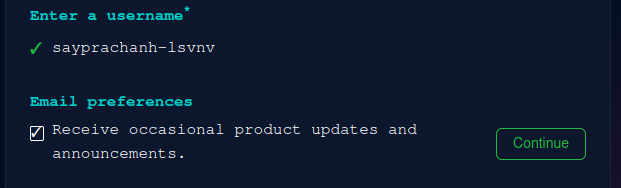

(Рис .4.1 Заполнение данных учетной записи на GitHub)

Аккаунт создан (Рис .4.2)

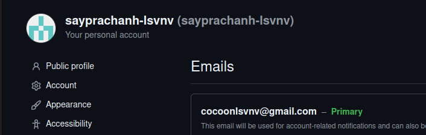
 
(Рис .4.2 Аккаунт GitHub)

# 4.2	Базовая настройка Git
Открываю терминал и произвожу предварительную настройку git. Я ввожу команду "git config –global user.name”, указывая свое имя, и команду "git config –global user.email "work@mail", указывая в ней свой адрес электронной почты. (Рис .4.3)
 
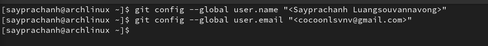

(Рис .4.3 Предварительная настройка Git)

Я настраиваю utf-8 в выходных данных сообщений git для корректного отображения имен файлов и символов (Рис .4.4)

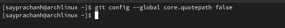
 
(Рис .4.4 Установка кодировки)

имя для начальной ветки (в этом случае я называю ее "master"). (Рис .4.5)

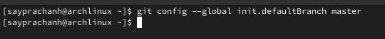
 
(Рис .4.5 Установка имени для начальной ветки)

Я задаю параметру autocrlf со значением input (Рис .4.6), поскольку я работаю в системе Linux, я гарантирую, что файлы будут Конвертировать из CRLF в LF при коммитах. CR и LF - это символы, которые используются для обозначения разрыва строки в тексте/файлах.

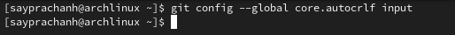

(Рис .4.6 Параметр autocrlf) 

Используя команду "git config --global core.safepath" и значение "warn", я настраиваю Git так, чтобы он выдавал предупреждение, когда я пытаюсь получить доступ к файлам за пределами текущего репозитория. (Рис .4.7)

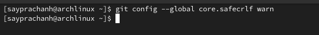

(Рис .4.7 Параметр safecrlf)
# 4.3	Создание SSH ключа
Потом, для последующей идентификации пользователя на сервере репозиториев необходимо сгенерировать пару ключей (приватный и открытый). Для этого я использую команду "ssh-keygen -C "имя, фамилия", work@email", а также указываю имя и электронную почту владельца. Ключ будет автоматически сохранен в каталоге "~/.ssh". (Рис 4.8)

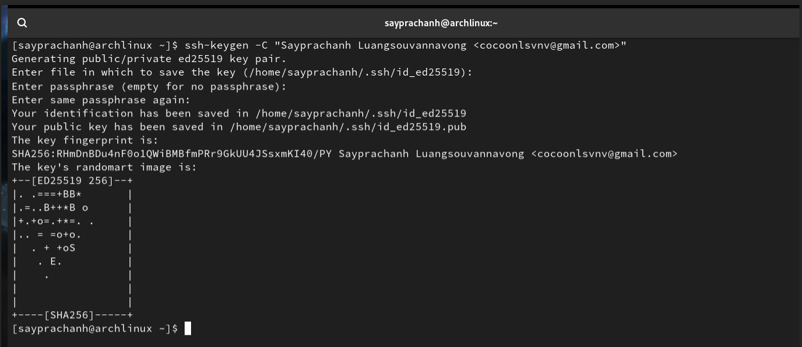

(Рис .4.8 Генерация SSH-ключа)

Xclip - это утилита, которая позволяет копировать текст из терминала.
Но, к сожалению, в дистрибутиве Arch Linux ее необходимо устанавливать отдельно. Я использую команду pacman -S для установки Xclip и ввожу sudo в начале команды от имени суперпользователя (Рис .4.9)

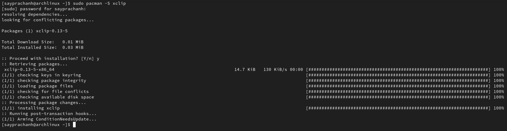
 
(Рис .4.9 Установка Xclip)

После установки Xclip, я продолжаю лабораторную работу, используя команды cat и xclip, я копирую ключ из каталога "/.ssh/id_ed25519.pub", в котором он был сохранен. (Рис .4.10)

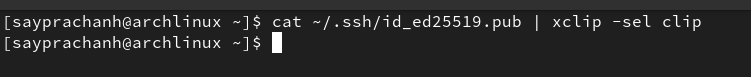

(Рис .4.10 Копирование содержимого файла)

Я открываю браузер и захожу на сайт GitHub, затем захожу в свой профиль и выбираю страницу "SSH и GPG Keys", нажимаю кнопку "New SSH key", чтобы добавить SSH ключ, который копирую с терминала (Рис .4.11)

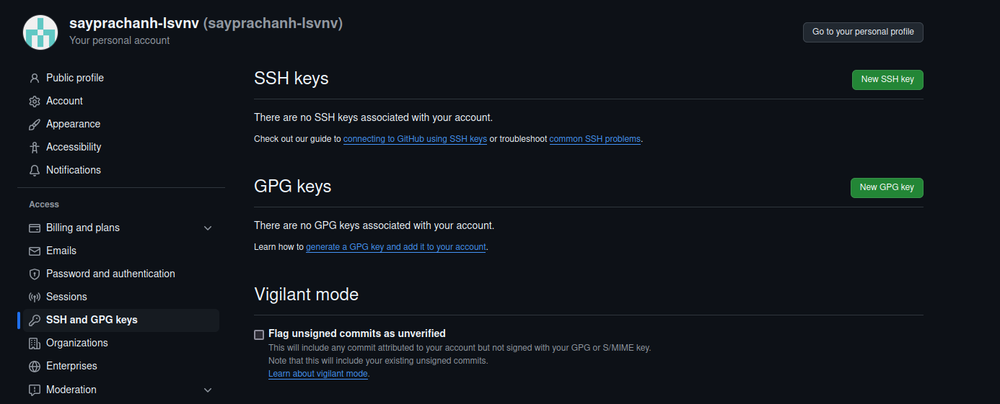
 
(Рис .4.11 Страница SSH and GPG keys)

Вставляю ключ в раздел Key, а также задаю название SSH-ключа, затем нажимаю "Add SSH key", чтобы завершить добавление ключа (Рис .4.12)

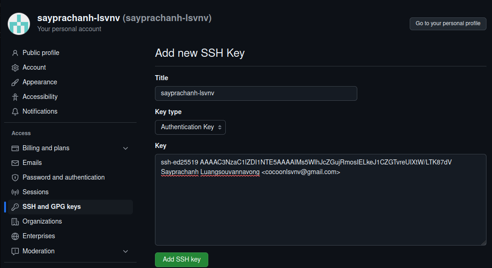
 
(Рис .4.12 Добавление SSH-ключа)
# 4.4	Сознание рабочего пространства и репозитория курса на основе шаблона
После этого, используя утилиту mkdir и опцию -p, я создаю каталог рабочего пространства, после home "~/work/study/2024-2025/Архитектура компьютера ", который я создаю рекурсивно. Затем, используя команду ls, я проверяю правильность выполнения команды (Рис .4.13)

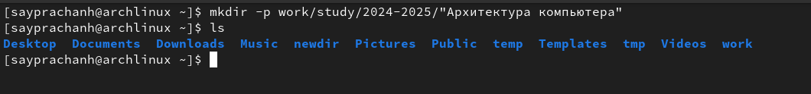

(Рис .4.13 Создание каталога для работы)
## 4.5	Сознание репозитория курса на основе шаблона
Я перехожу на страницу репозитория с шаблоном курса "https://github.com/yamadharma/course-directory-student-template" в браузере. 
Затем я выбираю "Use this template", чтобы использовать этот шаблон для своего репозитория (Рис .4.14)

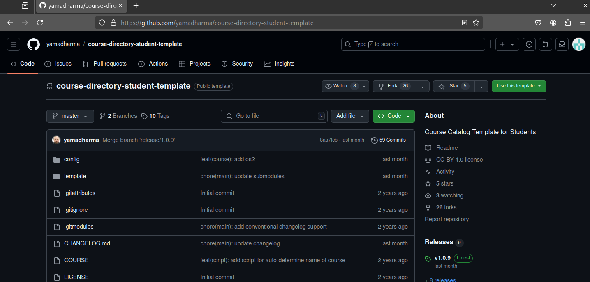

(Рис .4.14 Страница шаблона для репозитория)

В открывшемся окне, я задаю имя репозитория (repository name) "study_2024-2025_arh-pc" и создаю репозиторий, нажав на кнопку "Create repository" (Рис .4.15)

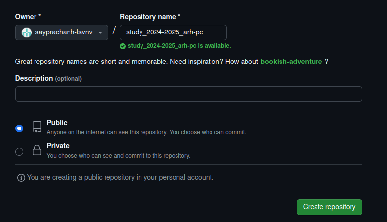
 
(Рис .4.15 создание репозитория)

Репозиторий создан (Рис .4.16)

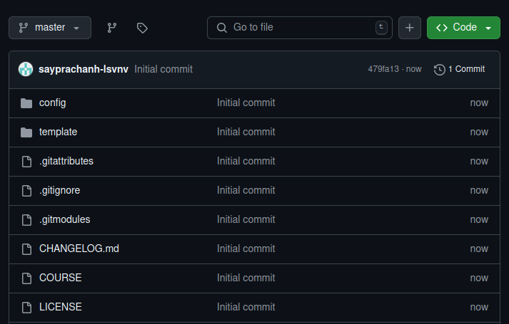
 
 (Рис .4.16 Созданный репозиторий)

Затем я захожу в терминал, используя утилиту cd, перехожу в каталог "~/work/study/2024-2025/Архитектура компьютера ". (Рис .4.17)

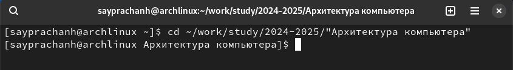
 
(Рис .4.17 Перемещение между каталогами)

Я клонирую созданный репозиторий, используя команду “git clone -recursive git@github.com:/sayprachanh-lsvnv/study_2024-2025_arh-pc.git arch-pc”. (Рис .4.18)

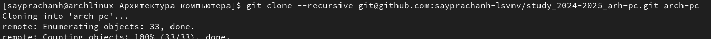
 
(Рис .4.18 Клонирование репозитория)

Я копирую ссылку для клонирования на страницу созданного репозитория, перейдя в окно "Code", затем выбираю "SSH" (Рис .4.19)

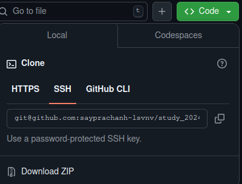
 
(Рис .4.19 Окно со ссылкой для клонирования репозитория)
# 4.6	Настройка каталога курса
Я перехожу в каталог arch-pc с помощью утилиты cd (Рис .4.20)

 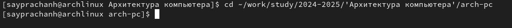

(Рис .4.20 Перемещение между каталогами)

команду rm, я удаляю ненужные файлы, а именно файл "package.json". (Рис .4.21)

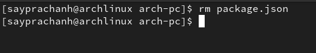
 
(Рис .4.21 Удаление файла)

Создайте необходимые каталоги (Рис .4.22)

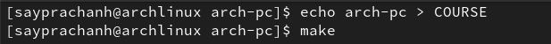
 
(Рис .4.22 Создание каталогов)

Затем я отправляю локальный каталог и файлы на сервер: используя команду "git add . ", я добавляю все созданные каталоги. Затем, используя git commit, я сохраняю изменения и комментирую их на сервере. (Рис .4.23)

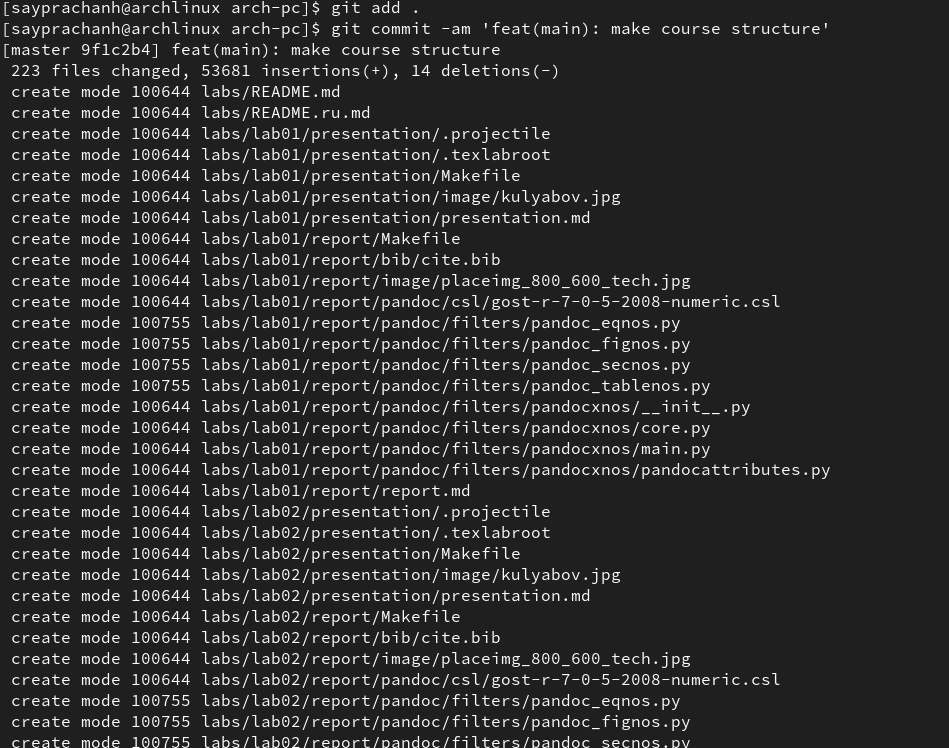
 
(Рис .4.23 Добавление и сохранение изменений на сервере)

отправьте все это на сервер с помощью команды git push (Рис .4.24)

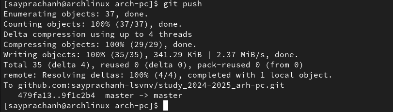
 
(Рис .4.24 Отправка изменений на сервер)

Затем я захожу на сайт GitHub, чтобы проверить правильность работы (Рис .4.25)

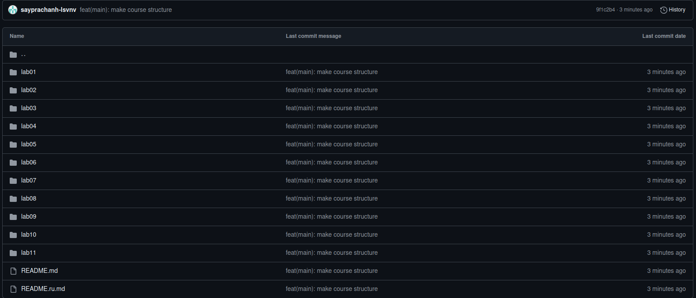
 
(Рис .4.25 Страница репозитория)
# 5.	Выполнение заданий для самостоятельной работы
Сначала я перехожу в каталог labs/lab02/report с помощью команды cd, затем, используя touch, создаю файл отчета для второй лабораторной работы в каталоге (Рис .5.1)

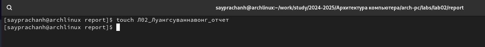
 
(Рис .5.1 Создание файла)

затем я ищу программу, которую буду использовать для написания отчета, в данном случае я использую LibreOffice Writer (Рис .5.2)

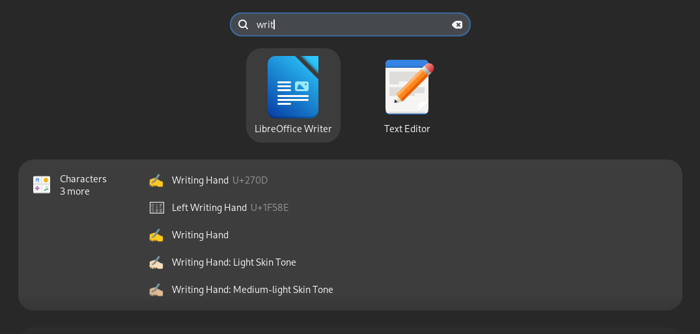
 
(Рис .5.2 Меню поиска)

После запуска программы, я открываю в ней файл и начинаю работать над отчетом (Рис .5.3)

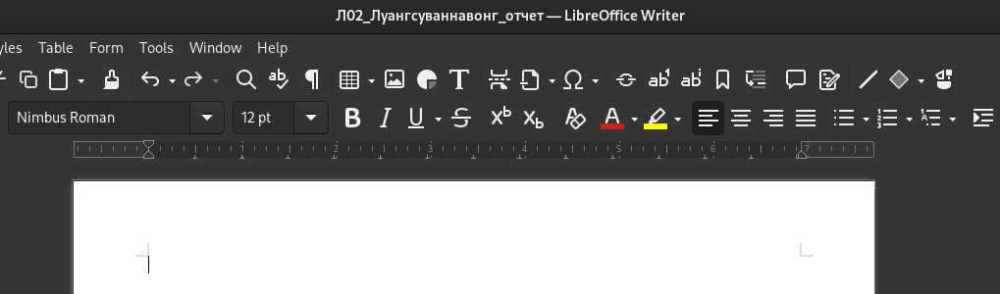
 
(Рис .5.3 Работа с отчетом с программой LibreOffice Writer)

Я перехожу из подкаталога lab03/report в подкаталог lab01/report с помощью утилиты cd (Рис .5.4)

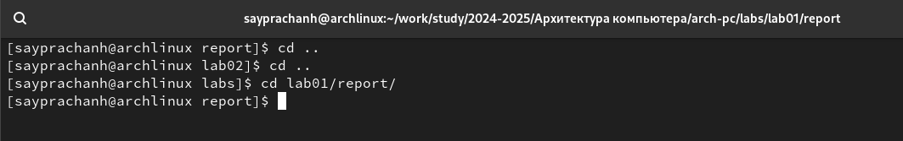
 
(Рис .5.4 Перемещение по каталогам)

Затем, используя команду ls, я проверяю наличие файла первой лабораторной работы, который должен находиться в подкаталоге Downloads домашнего каталога (Рис .5.5)

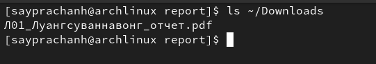

(Рис .5.5 Проверка местонахождения файлов)

используя утилиту cp , я копирую файл первой лабораторной работы из подкаталога Downloads в подкаталог lab1/report и проверяю правильность выполнения команды с помощью команды ls (Рис .5.6)

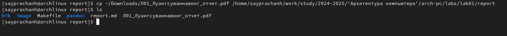
 
(Рис .5.6 Копирование файла)

добавляю файл в коммит, используя команду git add Л01_Луангсуваннавонг_отчет.pdf (Рис .5.7)

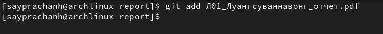
 
(Рис .5.7 Добавление файла на сервер)

После этого я перехожу в репозиторий lab02 и проделываю то же самое со вторым файлом лабораторной работы: Я добавляю файл с помощью git add, затем сохраняю изменения на сервере с помощью git commit (Рис .5.8)

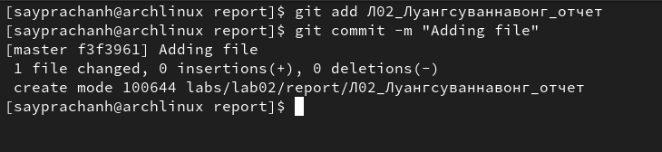 
(Рис .5.8 Добавление и сохранение изменений на сервере)

Я отправляю сохраненные файлы изменений в основной репозиторий на сервере, используя команду git push -f origin master (Рис .5.9)

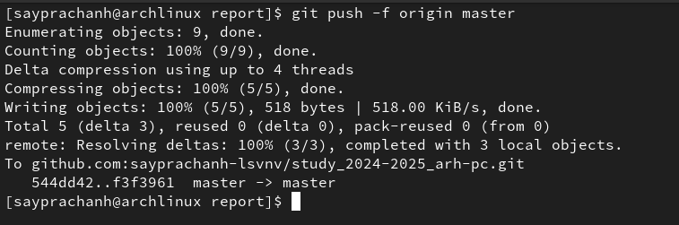 
(Рис .5.9 Загрузка файлов на сервер)

Захожу на сайт Github, чтобы проверить корректность работы, мы видим, что отображаются комментарии команды commit (Рис .5.10)

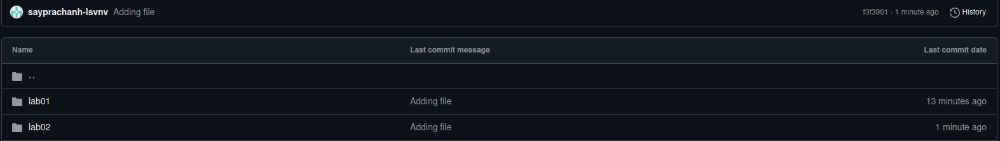
 
(Рис .5.10 Страница каталога в репозитории)

Захожу в оба каталога, мы видим, что в каталоге lab01/report есть файл отчета о первой лабораторной работе, а также в каталоге lab02/report, в котором есть файл отчета о второй лабораторной работе (Рис .5.11 и Рис .5.12)

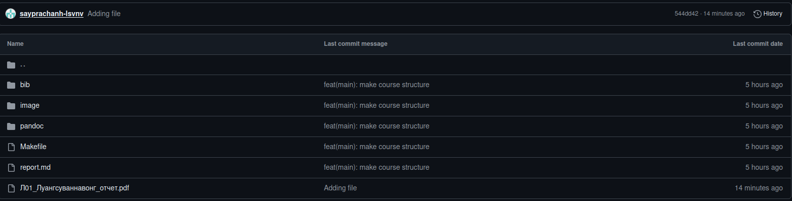
 
(Рис .5.11 Каталог lab01/report)

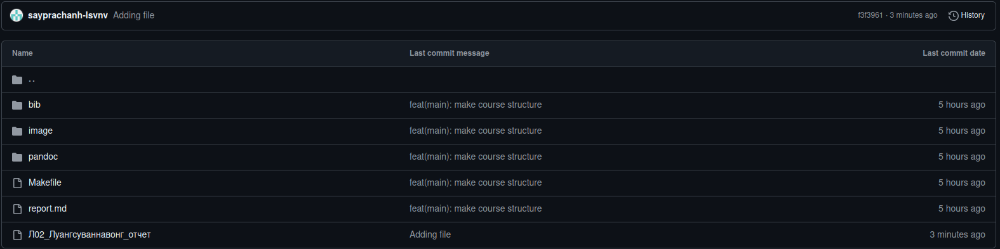
 
(Рис .5.12 Каталог lab02/report)

# 6. Выводы

Во время этой лабораторной работы я изучил и понял идеологию и применение инструментов контроля версий, а также приобрел практические навыки работы с системой git.

# 7. Источники
1.	[Архитектура ЭВМ](https://esystem.rudn.ru/pluginfile.php/2089082/mod_resource/content/0/Лабораторная%20работа%20№2.%20Система%20контроля%20версий%20Git.pdf)
2.  [Git - Документация](https://git-scm.com/doc)
