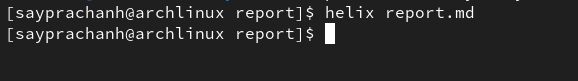

---
## Front matter
title: "Отчёт по лабораторной работе №3"
subtitle: "Дисциплина: Архитектура компьютера"
author: "Луангсуваннавонг Сайпхачан"

## Generic otions
lang: ru-RU
toc-title: "Содержание"

## Bibliography
bibliography: bib/cite.bib
csl: pandoc/csl/gost-r-7-0-5-2008-numeric.csl

## Pdf output format
toc: true # Table of contents
toc-depth: 2
lof: true # List of figures
lot: false # List of tables
fontsize: 12pt
linestretch: 1.5
papersize: a4
documentclass: scrreprt
## I18n polyglossia
polyglossia-lang:
  name: russian
  options:
	- spelling=modern
	- babelshorthands=true
polyglossia-otherlangs:
  name: english
## I18n babel
babel-lang: russian
babel-otherlangs: english
## Fonts
mainfont: IBM Plex Serif
romanfont: IBM Plex Serif
sansfont: IBM Plex Sans
monofont: IBM Plex Mono
mathfont: STIX Two Math
mainfontoptions: Ligatures=Common,Ligatures=TeX,Scale=0.94
romanfontoptions: Ligatures=Common,Ligatures=TeX,Scale=0.94
sansfontoptions: Ligatures=Common,Ligatures=TeX,Scale=MatchLowercase,Scale=0.94
monofontoptions: Scale=MatchLowercase,Scale=0.94,FakeStretch=0.9
mathfontoptions:
## Biblatex
biblatex: true
biblio-style: "gost-numeric"
biblatexoptions:
  - parentracker=true
  - backend=biber
  - hyperref=auto
  - language=auto
  - autolang=other*
  - citestyle=gost-numeric
## Pandoc-crossref LaTeX customization
figureTitle: "Рис."
tableTitle: "Таблица"
listingTitle: "Листинг"
lofTitle: "Список иллюстраций"
lotTitle: "Список таблиц"
lolTitle: "Листинги"
## Misc options
indent: true
header-includes:
  - \usepackage{indentfirst}
  - \usepackage{float} # keep figures where there are in the text
  - \floatplacement{figure}{H} # keep figures where there are in the text
---

# Цель работы

Цель данной лабораторной работы является понятие и освоение процедуры создания с помощью легковесного языка разметки Markdown.

# Задание
  1.	установка необходимого ПО
  2.	Выполнение лабораторной работы
  3.	Задание для самостоятельной работы
  4.  Ответы на вопросы для самопроверки
  
# Теоретическое введение

Markdown — это легковесный язык разметки, созданный для форматирования текста, который остается легким для чтения людьми и позволяет легко преобразовывать его в более сложные форматы публикаций. 
Он поддерживает форматирование внутритекстовых формул, аналогичное LaTeX. Чтобы вставить изображения в документ Markdown, достаточно указать URL изображения. Синтаксис для встроенных ссылок использует текст ссылки в квадратных скобках и URL или имя файла в круглых скобках (например, [link text](file-name.md)). 
Кроме того, Markdown позволяет включать фрагменты кода в текст и отображать их в виде отдельных огражденных блоков, что упрощает выделение синтаксиса кода.# Выполнение лабораторной работы

# Установка необходимого программного обеспечения
## установка TaxLive

Скачал TexLive с официального сайта, который загружен в каталог загрузки (Рис. 4.1)

Я перехожу в каталог загрузки и распаковываю архив. (Рис. 4.2)

Затем, использу я cd, я перехожу в распакованную папку и запускаю скрипт "./install-tl" с правами root, а также использую команду sudo в начале команды (Рис. 4.3 и Рис. 4.4)

После этого, добавляю /usr/local/texlive/2024/bin/x86_64-linux в свой PATH (Рис. 4.5)

## установка pandoc и pacdoc-crossref

Скачиваю pandoc и pandoc-crossref из репозитория создателя на GitHub (Рис. 4.6 и Рис. 4.7)

Проверяю содержимое каталога загрузки (Рис. 4.8)

Затем я распаковываю оба загруженных архива (Рис. 4.9 и Рис. 4.10)

Используя команды sudo и copy, я копирую pandoc и pandoc-crossref в каталог "/usr/local/bin". (Рис. 4.11 и Рис. 4.12)

Затем я перечисляю каталог "/usr/local/bin" с помощью команды ls, чтобы проверить правильность предварительно выполненных действий(Рис. 4.13)

# Выполнение лабораторной работы

Я захожу в каталог курсов, который был создан во время выполнения последней лабораторной работы(Рис. 5.1)

Используя команду git pull, я обновляю локальный репозиторий, загружая изменения из удаленного репозитория 
(в данном случае я предварительно обновил локальный репозиторий, поэтому он отображает "Already up to date")(Рис. 5.2).

Затем я перехожу в каталог labs/lab03/report.(Рис. 5.3)

Введя команду make, я компилирую шаблон с использованием Makefile(Рис. 5.4)

Я открываю сгенерированный файл report.docx в LibreOffice Writer(Рис. 5.5)

и я также открываю сгенерированный файл report.pdf, чтобы проверить, что все сгенерировано правильно(Рис. 5.6)

Я удаляю полученные файлы с использованием Makefile используя команду make clean, затем использую команду ls, чтобы проверить, удалены ли файлы(Рис. 5.7)

Я открываю файл report.md с помощью текстового редактора helix(Рис. 5.8 и Рис. 5.9)

Я копирую файл report.md с новым именем, так как хочу сохранить исходный файл(Рис. 5.10)

затем я начинаю заполнять отчет, используя язык разметки Markdown в скопированном файле(Рис. 5.11)

после этого я компилирую файл отчета и загружаю его на GitHub

# Задание для самостоятельной работы

Сначала я перехожу к lab02/report, а также перечисляю содержимое каталога(Рис. 6.1)

после этого я копирую report.md с новым именем для заполнения отчета(Рис. 6.2)

Я открываю файл и начинаю заполнять отчет с помощью текстового редактора helix(Рис. 6.3)

Я удаляю старые файлы отчетов, так как не хочу, чтобы они мешали работе с новыми отчетами(Рис. 6.4)

Компилирую файл отчета о лабораторной работе(Рис. 6.5)

затем я проверяю, правильно ли сгенерированы файлы отчетов(Рис. 6.6)

.png)

Я удаляю лишние сгенерированные файлы report.docx и файл report.pdf, а также ненужную папку(Рис. 6.7)

используя git add, я добавляю изменения в GitHub, а также сохраняю изменения с помощью git commi(Рис. 6.8)

затем я загружаю изменения на сервер с помощью git push(Рис. 6.9)

проверка правильности работы в GitHub(Рис. 6.10)

# Выводы

В результате выполнения этой лабораторной работы я понял и освоил процедуру форматирования отчетов с помощью легковесного языка разметки Markdown.

# Вопросы для самопроверки

1. Что такое Markdown?

    Markdown — это легковесный язык разметки, предназначенный для упрощения форматирования текста, остающегося читаемым для человека, который остается читаемым и легко преобразуется в другие форматы (например, HTML).

2. Как в Markdown задается начертание шрифтов?

    В Markdown начертание шрифтов задается с помощью специальных символов. Например: чтобы выделить текст курсивом, можно использовать одиночные звездочки (*) или подчеркивания (_), а чтобы выделить текст жирным шрифтом, мы используем двойные символы ((**) или (__)). 

3. Как в Markdown оформляются списки?

    В Markdown поддерживаются два типа списков: упорядоченные и неупорядоченные.
    Неупорядоченные списки - мы используем символы (дефисы (-), плюсы (+) или звездочки (*))
    Упорядоченные списки - формируются с помощью цифр, за которыми следует точка.

4. Как в Markdown оформляются изображения и ссылки на них?

	  Изображения вставляются с помощью синтаксиса ``, а ссылки оформляются как `[link text](URL)`.

5. Как в Markdown оформляются математические формулы и ссылки на них?

	  Математические формулы оформляются аналогично LaTeX. Внутритекстовые формулы используют одинарные долларовые знаки (например $x + y = z$) и для блочной формулы мы используем двойные знаки доллара. 
	
# Список литературы
  [Архитектура ЭВМ](https://esystem.rudn.ru/pluginfile.php/2089083/mod_resource/content/0/Лабораторная%20работа%20№3.%20Язык%20разметки%20.pdf)

