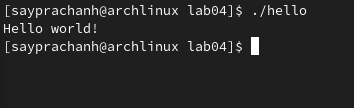
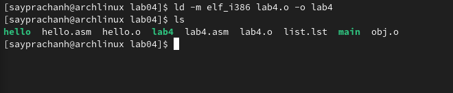

---
## Front matter
title: "Отчёт по лабораторной работе №4"
subtitle: "Дисциплина: Архитектура компьютера"
author: "Луангсуваннавонг Сайпхачан"

## Generic otions
lang: ru-RU
toc-title: "Содержание"

## Bibliography
bibliography: bib/cite.bib
csl: pandoc/csl/gost-r-7-0-5-2008-numeric.csl

## Pdf output format
toc: true # Table of contents
toc-depth: 2
lof: true # List of figures
lot: false # List of tables
fontsize: 12pt
linestretch: 1.5
papersize: a4
documentclass: scrreprt
## I18n polyglossia
polyglossia-lang:
  name: russian
  options:
	- spelling=modern
	- babelshorthands=true
polyglossia-otherlangs:
  name: english
## I18n babel
babel-lang: russian
babel-otherlangs: english
## Fonts
mainfont: IBM Plex Serif
romanfont: IBM Plex Serif
sansfont: IBM Plex Sans
monofont: IBM Plex Mono
mathfont: STIX Two Math
mainfontoptions: Ligatures=Common,Ligatures=TeX,Scale=0.94
romanfontoptions: Ligatures=Common,Ligatures=TeX,Scale=0.94
sansfontoptions: Ligatures=Common,Ligatures=TeX,Scale=MatchLowercase,Scale=0.94
monofontoptions: Scale=MatchLowercase,Scale=0.94,FakeStretch=0.9
mathfontoptions:
## Biblatex
biblatex: true
biblio-style: "gost-numeric"
biblatexoptions:
  - parentracker=true
  - backend=biber
  - hyperref=auto
  - language=auto
  - autolang=other*
  - citestyle=gost-numeric
## Pandoc-crossref LaTeX customization
figureTitle: "Рис."
tableTitle: "Таблица"
listingTitle: "Листинг"
lofTitle: "Список иллюстраций"
lotTitle: "Список таблиц"
lolTitle: "Листинги"
## Misc options
indent: true
header-includes:
  - \usepackage{indentfirst}
  - \usepackage{float} # keep figures where there are in the text
  - \floatplacement{figure}{H} # keep figures where there are in the text
---

# Цель работы

Целью данной лабораторной работы является освоение процедуры компиляции и сборки программ, написанных на ассемблере NASM.

# Задание
  1.	Создание программы Hello world!
  2.	работа с транслятором NASM
  3.	Работа с расширенным синтаксисом командной строки NASM
  4.  Работа с компоновщиком LD
  5.  Запуск исполняемого файла
  6.  Выполнение заданий для самостоятельной работы
  7.  Ответы на вопросы для самопроверки
  
# Теоретическое введение

  Основными функциональными компонентами любой ЭВМ являются центральный процессор, память и периферийные устройства. Эти устройства взаимодействуют через общую шину, которая соединяет их друг с другом. Физически шина представлена множеством проводников на материнской плате. Основная задача процессора — обработка информации и координация работы всех компонентов компьютера. В состав центрального процессора входят:
Арифметико-логическое устройство (АЛУ) - выполняющее логические и арифметические операции с данными из памяти.
Устройство управления (УУ) - обеспечивающее контроль над работой всех устройств.
Регистры - представляющие собой сверхбыструю оперативную память для временного хранения промежуточных результатов. Регистры делятся на два типа: общего назначения и специальные.
Для написания программ на ассемблере необходимо знать существующие регистры и их применение. Большинство ассемблерных команд используют регистры в качестве операндов, а команды представляют собой операции над данными в регистрах, включая их пересылку и преобразование. Доступ к регистрами осуществляется по именам, а не по адресам, как в основной памяти. Архитектура x86 включает следующие основные регистры общего назначения:

64-битные: RAX, RCX, RDX, RBX, RSI, RDI
32-битные: EAX, ECX, EDX, EBX, ESI, EDI
16-битные: AX, CX, DX, BX, SI, DI
8-битные: AH, AL, CH, CL, DH, DL, BH, BL

Другим важным элементом ЭВМ является оперативное запоминающее устройство (ОЗУ). Это быстродействующее энергозависимое хранилище, взаимодействующее с процессором, и предназначенное для хранения программ и данных, 
с которыми процессор работает в данный момент. ОЗУ состоит из пронумерованных ячеек памяти, адрес которых используется для доступа к данным.

Периферийные устройства делятся на устройства внешней памяти для долговременного хранения данных и устройства ввода-вывода для взаимодействия процессора с внешней средой. 
В основе вычислительного процесса ЭВМ лежит принцип программного управления, при котором задачи решаются последовательно по записанным программам.

Команды представляют собой двоичные коды, состоящие из операционной и адресной частей. Операционная часть содержит код команды, а адресная — данные или адреса, используемые в операции. 
При выполнении команды процессор проходит через стандартный командный цикл: формирование адреса команды, считывание и декодирование кода, выполнение команды и переход к следующей.

Язык ассемблера (assembly language, asm) — это низкоуровневый машинно-ориентированный язык. NASM — это открытый проект ассемблера, доступный для различных операционных систем, поддерживающий Intel-синтаксис и инструкции x86-64.

# Выполнение лабораторной работы
## Создание программы Hello world!

Сначала я открываю терминал и создаю новую директорию "lab04" для работы с программой на языке ассемблера NASM (Рис. 4.1) и 
затем я перехожу в созданный каталог (Рис. 4.2)

Используя команду "touch", я создаю пустой текстовый файл "hello.asm" в текущем каталоге (Рис. 4.3)

Я открываю созданный файл в текстовом редакторе helix(Рис. 4.4 и Рис. 4.5)

Затем я заполняю файл, вставляя в программу для вывода "Hello world!" (Рис. 4.6)

## Работа с транслятором NASM

Выполняя команду nasm -f elf hello.asm, я преобразую текст программы "Hello world! " в объектный код с помощью транслятора TASM. ( -f в команде указывает транслятору nasm, что требуется создать двоичный файл в формате ELF) (Рис. 4.7). 
Затем я проверяю правильность выполнения команды, мы видим, что файл "hello.o" создан.
 

## Работа с расширенным синтаксисом командной строки NASM

После этого я ввожу команду, которая скомпилирует исходный файл hello.asm в obj.o (Рис. 4.8), а также установит формат выходного файла в elf, при этом в него будут включены символы отладки (опция -g), и с помощью ключа -l также будет создан файл lst.lst.
Далее я проверяю правильность выполнения команды

## Работа с компоновщиком LD

Я передаю объектный файл hello.o компоновщику ld, чтобы получить исполняемую программу hello. (ключ -o задаёт имя создаваемого исполняемого файла)(Рис. 4.9).
Затем, используя команду ls, я проверяю правильность выполненной команды

Затем я ввожу следующую команду. Исполняемый файл будет иметь имя main, потому что после ключа -o было задано значение, в данном случае это было значение main, а объектным файлом, который скомпилировал этот исполняемый файл, является obj.o (Рис. 4.10)

## Запуск исполняемого файла

Наконец, я запускаю созданный исполняемый файл hello (Рис. 4.11)

# Выполнение заданий для самостоятельной работы

В текущем каталоге я копирую файл hello.asm и называю его lab4.asm с помощью утилиты cp (Рис. 5.1)

Используя текстовый редактор helix, я редактирую содержимое в lab4.asm и заполняю программу, которая будет выводить мое имя и фамилию при запуске программы (Рис. 5.2)

Я компилирую текст программы в объектный файл, затем, используя ls, проверяю, создан ли объектный файл lab4.o (Рис. 5.3)

Затем я передаю объектный файл lab4.o компоновщику ld, чтобы получить исполняемый файл lab4 (Рис. 5.4)

Запускаю созданный исполняемый файл lab4, и мы видим, что в нем отображаются мои имя и фамилия (Рис. 5.5)

 

Копирую файлы hello.asm и lab4.asm в каталог курса lab04, созданный на основе прошлых лабораторных работ (Рис. 5.6). Затем проверяю правильность выполненной команды
 

Используя команду git add . и git commit, я добавляю файлы на GitHub с комментарием "добавляю файлы для лабораторной работы № 5". (Рис. 5.7)

Наконец, я загружаю файлы на сервер с помощью команды git push (Рис. 5.8)

# Выводы

При выполнении данной лабораторной работы, я освоил процедуру компиляции и сборки программ, написанных на ассемблере NASM.

# Ответы на вопросы для самопроверки

 1. Какие основные отличия ассемблерных программ от программ на языках высокого уровня?

	Отличия ассемблера и языков высокого уровня: Ассемблер ближе к машинам, сложнее, требует знаний о компьютере. Языки высокого уровня проще и удобнее.

 2. В чём состоит отличие инструкции от директивы на языке ассемблера?

	Инструкция и директива: Инструкция выполняет действия (сложение чисел или перемещение данных), а Директива — это указание для компилятора, например, как организовать память или какие данные использовать. 
  Директивы не выполняются, они просто помогают программе работать правильно.

 3. Перечислите основные правила оформления программ на языке ассемблера?

	При написании программы на ассемблере нужно соблюдать несколько правил. Каждая строка должна содержать либо инструкцию, либо директиву. Хорошо использовать метки для удобства. 
  Важно добавлять комментарии, чтобы объяснить код. Также следите за правильным синтаксисом и отступами для лучшей читаемости.

 4. Каковы этапы получения исполняемого файла?
	
  Чтобы получить исполняемый файл, нужно пройти несколько этапов. Сначала пишется исходный код на ассемблере, затем он преобразуется в объектный файл. 
  После этого компоновщик объединяет объектные файлы в один исполняемый файл, который можно запускать на компьютере.

 5. Каково назначение этапа трансляции?

	Этап трансляции преобразует исходный код из ассемблера в объектный файл с машинным кодом, который понимает процессор. Без него программа не будет работать.

 6. Каково назначение этапа компоновки?
	
  Компоновка объединяет разные объектные файлы в один исполняемый файл и связывает части программы для корректной работы, особенно если они зависят друг от друга.

 7. Какие файлы могут создаваться при трансляции программы,какие из них создаются по умолчанию?
	
  При трансляции создаётся несколько файлов. Основной — объектный файл, который создаётся по умолчанию. Также могут быть листинг-файл с ассемблерным кодом и файл с сообщениями об ошибках, если есть ошибки в коде.

 8. Каковы форматы файлов для nasm и ld?
	
  NASM поддерживает различные форматы файлов, такие как ELF (обычно для Linux) и COFF (для Windows). LD, компоновщик, также использует формат ELF для Linux и COFF для Windows.

# Список литературы
  [Архитектура ЭВМ](https://esystem.rudn.ru/pluginfile.php/2089084/mod_resource/content/0/Лабораторная%20работа%20№4.%20Создание%20и%20процесс%20обработки%20программ%20на%20языке%20ассемблера%20NASM.pdf)

