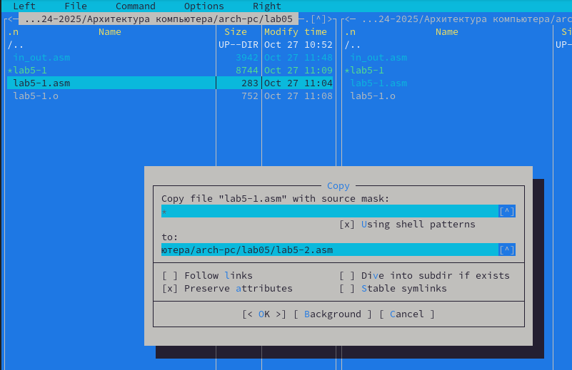

---
## Front matter
title: "Отчёт по лабораторной работе №5"
subtitle: "Дисциплина: Архитектура компьютера"
author: "Луангсуваннавонг Сайпхачан"

## Generic otions
lang: ru-RU
toc-title: "Содержание"

## Bibliography
bibliography: bib/cite.bib
csl: pandoc/csl/gost-r-7-0-5-2008-numeric.csl

## Pdf output format
toc: true # Table of contents
toc-depth: 2
lof: true # List of figures
lot: false # List of tables
fontsize: 12pt
linestretch: 1.5
papersize: a4
documentclass: scrreprt
## I18n polyglossia
polyglossia-lang:
  name: russian
  options:
	- spelling=modern
	- babelshorthands=true
polyglossia-otherlangs:
  name: english
## I18n babel
babel-lang: russian
babel-otherlangs: english
## Fonts
mainfont: IBM Plex Serif
romanfont: IBM Plex Serif
sansfont: IBM Plex Sans
monofont: IBM Plex Mono
mathfont: STIX Two Math
mainfontoptions: Ligatures=Common,Ligatures=TeX,Scale=0.94
romanfontoptions: Ligatures=Common,Ligatures=TeX,Scale=0.94
sansfontoptions: Ligatures=Common,Ligatures=TeX,Scale=MatchLowercase,Scale=0.94
monofontoptions: Scale=MatchLowercase,Scale=0.94,FakeStretch=0.9
mathfontoptions:
## Biblatex
biblatex: true
biblio-style: "gost-numeric"
biblatexoptions:
  - parentracker=true
  - backend=biber
  - hyperref=auto
  - language=auto
  - autolang=other*
  - citestyle=gost-numeric
## Pandoc-crossref LaTeX customization
figureTitle: "Рис."
tableTitle: "Таблица"
listingTitle: "Листинг"
lofTitle: "Список иллюстраций"
lotTitle: "Список таблиц"
lolTitle: "Листинги"
## Misc options
indent: true
header-includes:
  - \usepackage{indentfirst}
  - \usepackage{float} # keep figures where there are in the text
  - \floatplacement{figure}{H} # keep figures where there are in the text
---

# Цель работы

Целью данной лабораторной работы является приобретение практических навыков работы в Midnight Commander, освоение инструкций языка ассемблера move и int.

# Задание
  1.	Основы работы с Midnight Commander
  2.	Структура программы на языке ассемблера NASM
  3.	Подключение внешнего файла
  4.  Выполнение заданий для самостоятельной работы
  
# Теоретическое введение

  Midnight Commander (или просто mc)—это программа,которая позволяет просматривать
 структуру каталогов и выполнятьосновные операции по управлению файловой системой,
 т.е. mc является файловым менеджером. Midnight Commander позволяет сделать работу с
 файлами более удобной и наглядной.

Программа на языке ассемблера NASM,как правило, состоитизтрёх секций: секция кода
 программы (SECTION .text),секция инициированных (известных во время компиляции)
 данных (SECTION .data) и секция неинициализированных данных (тех, под которые во
 время компиляциитолько отводится память,а значение присваивается в ходе выполнения
 программы) (SECTION .bss).

Для объявления инициированных данных в секции .data используются директивы DB,DW,
 DD, DQ и DT,которые резервируют памятьи указывают,какие значениядолжны храниться в
 этой памяти:
 • DB(define byte) — определяет переменную размером в 1 байт;
 • DW(define word) — определяет переменную размеров в 2 байта (слово);
 • DD(define double word) — определяет переменную размером в 4 байта (двойное слово);
 • DQ(define quad word) — определяет переменную размером в 8 байт(учетверённое слово);
 • DT(define ten bytes) — определяет переменную размером в 10 байт

 Директивы используются для объявления простых переменных и для объявления масси
вов. Для определения строк принято использовать директиву DB в связи с особенностями
 хранения данных в оперативной памяти.

 Инструкция языка ассемблера mov предназначена для дублирования данных источника в
 приёмнике

`mov dst, src`

 Здесь операнд dst — приёмник,а src — источник.
 В качестве операнда могутвыступать регистры (register),ячейки памяти (memory) и непо
средственные значения (const).

Инструкция языка ассемблера int предназначена для вызова прерывания с указанным
 номером.

`int n`

 Здесь n — номер прерывания, принадлежащий диапазону 0 – 255.
 При программировании в Linux сиспользованием вызовов ядра sys_calls n=80h (принято
 задавать в шестнадцатеричной системе счисления).

# Выполнение лабораторной работы
## Основы работы с Midnight Commander

Сначала я открываю терминал и ввожу команду mc, чтобы открыть Midnight Commander (Рис. 4.1)


Использую клавиши со стрелками (↑),(↓) и клавишу Enter для перемещения по каталогам. Я перехожу к каталогу ~work/arch-pc, где я выполнял лабораторную работу № 4.(Рис. 4.2)


Используя клавишу F7, я создаю папку внутри каталога arch-pc, которую называю lab05 (Рис. 4.3)


перехожу в созданный каталог (Рис. 4.4)


Используя команду touch lab5-1.asm, я создаю файл на языке ассемблера, в котором я буду работать (Рис. 4.5)


## Структура программы на языке ассемблера NASM

Я использую функциональную клавишу F4, открываю созданный файл для редактирования в редакторе mcedit (Рис. 4.6)


Я ввожу программный код, который запрашивает у пользователя ввод строки.
Затем я сохраняю файл, используя клавишу (F2), и закрываю файл (F10). (Рис. 4.7)


используя функциональную клавишу F3, я открываю файл для просмотра, чтобы проверить, содержит ли программный файл коды (Рис. 4.8)


После этого я транслирую текстовый файл программы в объектный файл с помощью команды nasm -f elf lab5-1.asm., которая создала lab5-1.o.
Затем, используя команду ld -m elf_i386 -o lab5-1 lab5-1.o, я выполняю компоновку объектного файла, и исполняемый файл lab5-1 был создан. (Рис. 4.9)


Я запускаю исполняемый файл(Рис. 4.10)


## Подключение внешнего файла

Скачиваю файл in-out.asm со страницы курса в ТУИС. Этот файл будет находиться в каталоге загрузки ("Downloads") (Рис. 4.11)


Используя функциональную клавишу F5, я копирую файл in_out.asm из каталога загрузки в созданный каталог lab05(Рис. 4.12)


Используя функциональную клавишу F5, я копирую файл lab5-1.asm в тот же каталог, но с другим именем, которое я меняю в процессе установки пути копирования (Рис. 4.13)



Я изменяю содержимое файла lab5-2.asm, чтобы программа использовала подпрограммы из внешнего файла in_out.asm(Рис. 4.14)


Используя команду nasm -f elf lab5-2.asm, я транслирую файл в объектный файл, который был создан lab5-2.o. После этого я создаю объектный файл, используя команду ld -m elf_i386 -o lab5-2 lab5-2.o, которая создает исполняемый файл lab6-2. 
Затем я запускаю исполняемый файл (Рис. 4.15)


 
Я снова открываю файл lab5-2, используя функциональную клавишу F4, затем изменяю содержимое файла с sprintLF на sprint. 
Затем я сохраняю файл и просматриваю его, используя F3, чтобы проверить, сохранен ли файл (Рис. 4.16)


Я снова транслирую файл, компоную созданный объектный файл и запускаю новый исполняемый файл lab5-2 (Рис. 4.17)


Разница между первым и вторым исполняемым файлом lab-2 заключается в том, что первый запрашивает ввод с новой строки, а второй запрашивает ввод без перехода на новую строку. (Рис. 4.17)

# Выполнение заданий для самостоятельной работы

Используя функциональную клавишу F5, я создаю копию файла lab5-1.asm и называю его lab5-1-1.asm (Рис. 5.1)


Открываю файл для редактирования с помощью функциональной клавиши F4. Затем я редактирую программу таким образом, чтобы она запрашивала ввод данных и выводила строку, введенную пользователем (Рис. 5.2)


Я создаю объектный файл lab5-1-1, затем передаю его на обработку компоновщику, получаю исполняемый файл lab5-1-1. Я запускаю исполняемый файл. 
Программа запрашивает ввод, я ввожу свое полное имя, затем программа выводит мои данные (Рис. 5.3)


 Код программы:
````
SECTION .text
GLOBAL _start
_start:

mov eax,4
mov ebx,1
mov ecx,msg
mov edx,msgLen
int 80h

mov eax, 3
mov ebx, 0
mov ecx, buf1
mov edx, 80
int 80h

mov eax,4
mov ebx,1
mov ecx,buf1
mov edx,buf1
int 80h

mov eax,1
mov ebx,0
int 80h
````
Я создаю копию файла lab5-2.asm и называю его lab5-2-1.acm с помощью функциональной клавиши F5 (Рис. 5.4)


Открываю файл для редактирования с помощью функциональной клавиши F4. Затем я редактирую программу таким образом, чтобы она запрашивала ввод данных и выводила строку, введенную пользователем (Рис. 5.5)


Я создаю объектный файл lab5-2-1, затем передаю его на обработку компоновщику, получаю исполняемый файл lab5-2-1. Я запускаю исполняемый файл. 
Программа запрашивает ввод без перехода на новую строку, я ввожу свое полное имя, затем программа выводит мои данные (Рис. 5.6)


 Код программы после редактирования:
````
%include 'in_out.asm'

SECTION .data
msg: DB 'Введите строку: ', 0h

SECTION .bss
buf1: RESB 80

SECTION .text
GLOBAL _start
_start:

mov eax,msg
call sprint

mov ecx, buf1
mov edx, 80

call sread

mov eax,4
mov edx,1
mov ecx,buf1
int 80h

call quit
````
# Выводы

При выполнении данной лабораторной работы, я освоил процедуру компиляции и сборки программ, написанных на ассемблере NASM.

# Ответы на вопросы для самопроверки

 1. Каково назначение mc?

	  Midnight Commander (mc) — это файловый менеджер, позволяющий удобно просматривать и управлять файлами в текстовом режиме.

 2. Какие операции с файлами можно выполнить как с помощью команд bash, так и с помощью меню(комбинаций клавиш) mc? Приведите несколько примеров.

    С помощью mc можно выполнять различные операции, такие как:

      - Копирование файлов: В bash команда cp file1.txt file2.txt и в mc можно использовать сочетание клавиш F5 для копирования.
      - Перемещение файлов: В bash команда mv file.txt /path/to/...(пункт назначения) и в mc используется F6 для перемещения.
      - Удаление файлов: В bash команда rm file.txt и в mc для удаления файла можно нажать F8.
      - Создание каталогов: В bash команда mkdir new_directory и в mc для создания каталога используется F7.

 3. Какова структура программы на языке ассемблера NASM?

       **SECTION .text**: Здесь находится исполняемый код программы. Это инструкции, которые процессор будет выполнять.

       **SECTION .data**: Эта секция используется для инициированных данных. Здесь переменные с известными значениями на этапе компиляции, например, строки и числа.

       **SECTION .bss**: В этой секции резервируется место для неинициализированных данных. Здесь объявляются переменные, значения которых будут заданы во время работы программы, но они не инициализируются.

 4. Для описаниякаких данных используются секции bss и data вязыке ассемблера NASM?

       **SECTION .data**: Используется для инициированных данных, содержащих переменные с известными значениями, например, числа или строки.

       **SECTION .bss**: Для неинициализированных данных, резервирующих место для переменных, значения которых будут заданы позже во время выполнения.

 5. Длячего используются компоненты db,dw,dd,dq и dt языка ассемблера NASM?

       - DB (define byte): 1 байт.
       - DW (define word): 2 байта.
       - DD (define double word): 4 байта.
       - DQ (define quad word): 8 байт.
       - DT (define ten bytes): 10 байт.

 6. Какое произойдётдействие при выполнении инструкции mov eax, esi?
	
    Инструкция mov eax, esi копирует значение из регистра esi в регистр eax. После выполнения этой инструкции eax будет содержать то же значение, что и esi.

 7. Для чего используется инструкция int 80h?
	
    Инструкция int 80h используется в Linux для системных вызовов. Она позволяет программам запрашивать услуги у ОС, помещая номер вызова в регистр eax. Когда вызывается int 80h, ОС выполняет нужное действие.
  
# Список литературы
  [Архитектура ЭВМ](https://esystem.rudn.ru/pluginfile.php/2089085/mod_resource/content/0/%D0%9B%D0%B0%D0%B1%D0%BE%D1%80%D0%B0%D1%82%D0%BE%D1%80%D0%BD%D0%B0%D1%8F%20%D1%80%D0%B0%D0%B1%D0%BE%D1%82%D0%B0%20%E2%84%965.%20%D0%9E%D1%81%D0%BD%D0%BE%D0%B2%D1%8B%20%D1%80%D0%B0%D0%B1%D0%BE%D1%82%D1%8B%20%D1%81%20Midnight%20Commander%20%28%29.%20%D0%A1%D1%82%D1%80%D1%83%D0%BA%D1%82%D1%83%D1%80%D0%B0%20%D0%BF%D1%80%D0%BE%D0%B3%D1%80%D0%B0%D0%BC%D0%BC%D1%8B%20%D0%BD%D0%B0%20%D1%8F%D0%B7%D1%8B%D0%BA%D0%B5%20%D0%B0%D1%81%D1%81%D0%B5%D0%BC%D0%B1%D0%BB%D0%B5%D1%80%D0%B0%20NASM.%20%D0%A1%D0%B8%D1%81%D1%82%D0%B5%D0%BC%D0%BD%D1%8B%D0%B5%20%D0%B2%D1%8B%D0%B7%D0%BE%D0%B2%D1%8B%20%D0%B2%20%D0%9E%D0%A1%20GNU%20Linux.pdf)
