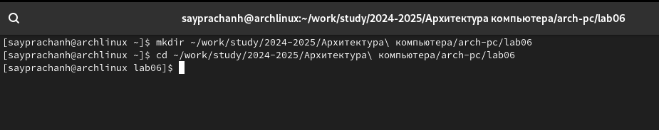
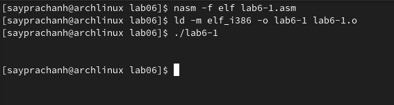
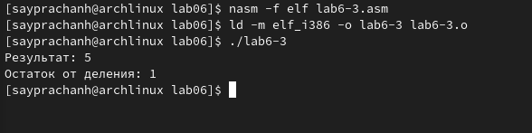

---
## Front matter
title: "Отчёт по лабораторной работе №6"
subtitle: "Дисциплина: Архитектура компьютера"
author: "Луангсуваннавонг Сайпхачан"

## Generic otions
lang: ru-RU
toc-title: "Содержание"

## Bibliography
bibliography: bib/cite.bib
csl: pandoc/csl/gost-r-7-0-5-2008-numeric.csl

## Pdf output format
toc: true # Table of contents
toc-depth: 2
lof: true # List of figures
lot: false # List of tables
fontsize: 12pt
linestretch: 1.5
papersize: a4
documentclass: scrreprt
## I18n polyglossia
polyglossia-lang:
  name: russian
  options:
	- spelling=modern
	- babelshorthands=true
polyglossia-otherlangs:
  name: english
## I18n babel
babel-lang: russian
babel-otherlangs: english
## Fonts
mainfont: IBM Plex Serif
romanfont: IBM Plex Serif
sansfont: IBM Plex Sans
monofont: IBM Plex Mono
mathfont: STIX Two Math
mainfontoptions: Ligatures=Common,Ligatures=TeX,Scale=0.94
romanfontoptions: Ligatures=Common,Ligatures=TeX,Scale=0.94
sansfontoptions: Ligatures=Common,Ligatures=TeX,Scale=MatchLowercase,Scale=0.94
monofontoptions: Scale=MatchLowercase,Scale=0.94,FakeStretch=0.9
mathfontoptions:
## Biblatex
biblatex: true
biblio-style: "gost-numeric"
biblatexoptions:
  - parentracker=true
  - backend=biber
  - hyperref=auto
  - language=auto
  - autolang=other*
  - citestyle=gost-numeric
## Pandoc-crossref LaTeX customization
figureTitle: "Рис."
tableTitle: "Таблица"
listingTitle: "Листинг"
lofTitle: "Список иллюстраций"
lotTitle: "Список таблиц"
lolTitle: "Листинги"
## Misc options
indent: true
header-includes:
  - \usepackage{indentfirst}
  - \usepackage{float} # keep figures where there are in the text
  - \floatplacement{figure}{H} # keep figures where there are in the text
---

# Цель работы

Целью данной лабораторной работы является освоение арифметических инструкций языка ассемблера NASM.

# Задание
  1.  Символьные и численные данные в NASM
  2.	Выполнение арифметических операций в NASM
  3.  Выполнение заданий для самостоятельной работы
  
# Теоретическое введение

  Большинство инструкций на языке ассемблера требуют обработки операндов. Адрес операнда предоставляет место,где хранятся данные,подлежащие обработке.Это могут быть
данные хранящиеся в регистре или в ячейке памяти.Далее рассмотрены все существующие способы задания адреса хранения операндов – способы адресации.
Существуеттри основных способа адресации:

 • Регистровая адресация - операнды хранятся врегистрах и в команде используются имена этих регистров,например: `mov ax,bx`.

 • Непосредственная адресация - значение операнда задается непосредственно в команде,Например: `mov ax,2`.

 • Адресация памяти - операнд задает адрес в памяти.В команде указывается символическое обозначение ячейки памяти,над содержимым которой требуется выполнить
 операцию.

  Ввод информации с клавиатуры и вывод её на экран осуществляется в символьном виде.
Кодирование этой информации производится согласно кодовойтаблице символов ASCII.
ASCII–сокращение от American Standard Code for Information Interchange (Американский
стандартный код для обмена информацией). Согласно стандарту ASCII каждый символ
кодируется одним байтом.

  Расширенная таблица ASCII состоит из двух частей. Первая (символы с кодами 0-127)
является универсальной (см. Приложение.), а вторая (коды 128-255) предназначена для
специальных символов и букв национальных алфавитов и на компьютерах разных типов
может меняться.

  Среди инструкций NASM нет такой,которая выводит числа (не в символьном виде). По
этому,например,чтобы вывести число,надо предварительно преобразовать его цифры в
ASCII-коды этих цифр и выводить на экран эти коды,а не само число.Если же выводить число
на экран непосредственно,то экран воспримет его не как число,а как последовательность
ASCII-символов–каждый байт числа будет воспринят как один ASCII-символ–и выведет на
экран эти символы.

  Аналогичная ситуация происходит и при вводе данных с клавиатуры. Введенные данные будут представлять собой символы,что сделает невозможным получение корректного
результата при выполнении над ними арифметических операций.

  Для решения этой проблемы не обходимо проводить преобразование ASCII символов в числа и обратно.

# Выполнение лабораторной работы
## Символьные и численные данные в NASM

С помощью команды mkdir я создаю новую директорию, в которой буду создавать файлы с программами для лабораторной работы № 6. (Рис. 4.1).
Я перехожу в созданную директорию с помощью команды cd



С помощью команды touch, я создаю файл lab6-1.asm(Рис. 4.2)


Я копирую файл in_out.asm из каталога загрузок, так как он будет использоваться в других программах(Рис. 4.3)


Я открываю созданный файл lab6-1.asm, затем вставляю программу для вывода значения регистра eax(Рис. 4.4)


Я создаю новый исполняемый файл программы и запускаю его(Рис. 4.5)
Программа выведет символ "j", потому что символ "j" в системе ASCII имеет код 106, который в двоичной системе представляется как 01101010. Программа выводит символ в соответствии с кодировкой ASCII.


Я снова захожу в программный файл и меняю символы "6" и "4" на цифры 6 и 4(Рис. 4.6)


Я создаю новый исполняемый файл программы и запускаю его (Рис. 4.7)
В результате выводится символ с кодом 10 — это символ перевода строки (Line Feed). Он не отображается на экране как видимый символ, но при его выводе текст перемещается на новую строку.



С помощью команды touch, я создаю файл lab6-2.asm(Рис. 4.8)


Я вхожу в программу, которая выводит значение регистра eax(Рис. 4.9)


Я создаю новый исполняемый файл программы и запускаю его.(Рис. 4.10)
Теперь программа выводит число 106 в качестве результата. Потому что эта программа позволяет выводить число (десятичное в ASCII), а не символ.


Я снова захожу в программный файл lab6-2.asm и меняю символы "6" и "4" на цифры 6 и 4(Рис. 4.11)


Теперь программа добавляет не код, соответствующий символам в системе ASCII, а сами числа, поэтому вывод равен 10(Рис. 4.12)


Я меняю программную функцию iprintLF на iprint в тексте программы(Рис. 4.13)


Я создаю и запускаю новый исполняемый файл (Рис. 4.14). Вывод не изменл, потому что символ новой строки не показался, когда программа использовала функцию iprintLF. 
В отличие от iprintLF, функция iprint не добавляет новый символ новой строки в вывод.


## Выполнение арифметических операций в NASM

С помощью команды touch, я создаю файл lab6-2.asm(Рис. 4.15)


Затем я ввожу в созданный файл программу, которая вычисляет значение выражения f(x) = (5 * 2 + 3)/3(Рис. 4.16)


Я создаю исполняемый файл и запускаю его(Рис. 4.17)


Я именяю программу, чтобы она вычисляла значение выражения f(x) = (4 * 6 + 2)/5(Рис. 4.18)


Затем я создаю и запускаю исполняемый файл (Рис. 4.19). Чтобы проверить правильность работы программы, я самостоятельно вычисляю значение выражения, программа работает правильно



С помощью команды touch, я создаю файл variant.asm(Рис. 4.20)


Затем я ввожу в созданный файл программу, которая вычисляет вариант задания на основе номера студенческого билета(Рис. 4.21)


Я создаю и запускаю исполняемый файл (Рис. 4.22). Я ввожу номер своего студенческого билета, и программа выдает, что мой вариант равен 13


                                                                                                                                                                                                                                                                                                                                                                                                                                                                                                                                                                                                                       
### ответы на вопросы

1. Какие строки листинга 6.4 отвечают за вывод на экран сообщения ‘Ваш вариант:’?

  ```` 
  mov eax, rem
  call sprint
  ````
  
2. Для чего используется следующие инструкции?
  
  ````
  mov ecx, x
  mov edx, 80
  call sread
  ````
  
`mov ecx, x` — записывает в регистр `ECX` значение переменной x, которое может быть адресом строки или её длиной.

`mov edx, 80` — записывает в регистр `EDX` максимальную длину вводимой строки.

`call sread` — вызывает подпрограмму sread, которая обеспечивает ввод строки с клавиатуры.

3. Для чего используется инструкция `“call atoi”`?
   
  `call atoi` используется для вызова подпрограммы из внешнего файла, которая преобразует строку (в формате ASCII) в целое число и записывает результат в регистр `EAX`.

4. Какие строки листинга 6.4 отвечаютза вычисления варианта?
  
   ````
   xor edx,edx ; обнуляем EDX для корректной работы div
   mov ebx,20 ; EBX = 20
   div ebx ; EAX=EAX/3, EDX=остаток от деления
   inc edx ; Увеличиваем EDX на 1 (edx = edx + 1)
   ````
  
5. В какой регистр записывается остаток от деления при выполнении инструкции “div ebx”?
   
  При выполнении инструкции “div ebx” остаток от деления записывается в регистр edx

6. Для чего используется инструкция “inc edx”?
   
  Инструкция inc edx используется для увеличения значения в регистре EDX на 1

7. Какие строки листинга 6.4 отвечают за вывод на экран результата вычислений?

  ````
  mov eax, edx
  call iprintLF
  ````

# Выполнение заданий для самостоятельной работы

Используя touch команду, я создаю файл lab6-4.asm(Рис. 5.1)


Я открываю созданный файл для редактирования и, поскольку мой вариант равен 13, ввожу в него программу для вычисления значения выражения (8x + 6)*10.(Рис. 5.2)


Я создаю и запускаю исполняемый файл.(Рис. 5.3)
Я ввожу значение 1, и она выдает 140, затем я снова запускаю исполняемый файл, чтобы проверить работу программы, я ввожу значение 4, и она выдает 380. Программа работает верно


 **Программа для вычисления значения выражения `(8x + 6)*10`**

 ````
%include 'in_out.asm'  ; подключение внешнего файла 
 SECTION .data  ; секция инициированных данных
 msg: DB 'Введите значение х: ',0
 rem: DB 'Результат: ',0
 SECTION .bss
 x: RESB 80
 SECTION .text  ; Код программы
 GLOBAL _start  ; Начало программы
 _start:
 ;---- Вычисление выражения
 mov eax, msg 
 call sprint
 
 mov ecx, x 
 mov edx, 80
 call sread
 mov eax,x  ; вызов подпрограммы преобразования
 call atoi  ; ASCII кода в число, `eax=x`
 mov ebx,8  ; EBX = 8
 mul ebx  ; EAX = EAX*EBX
 
 add eax,6  ; EAX = EAX + 6
 
 mov ebx,10  ; EBX = 10
 mul ebx  ; EAX = EAX*EBX
 
 mov edi,eax  ; запись результата вычисления в 'edi'
 ;---- Вывод результата
 mov eax,rem  ; вызов подпрограммы печати
 call sprint  ; сообщения 'Результат: '
 mov eax,edi  ; вызов подпрограммы печати значения
 call iprintLF  ; из 'edi' в виде символов
 call quit  ; вызов подпрограммы завершения   
 ````


# Выводы

При выполнении данной лабораторной работы, я освоил арифметические инструкции языка ассемблера NASM.

# Ответы на вопросы для самопроверки

1. Какой синтаксис команды сложения чисел?

   `add <регистр>, <операнд>`
	 
  Складывает два операнда и сохраняет результат в первый операнд.
  Пример:
  
  `add eax, ebx ; складывает значение ebx с ax и сохраняет результат в eax`

 2. Какая команда выполняет умножение без знака?

	  Команда mul умножает содержимое регистра eax на операнд. Результат сохраняется в два регистра: edx и eax.
  Пример:
  
  `mul ebx ;  умножает eax на ebx, результат в edx:eax`

 3. Какой синтаксис командыделение чисел без знака?

    Команда div делит число в регистрах edx:eax на операнд.

      Делимое: хранится в регистрах edx:eax.
      
      Частное: сохраняется в eax.
      
      Остаток: сохраняется в edx.
      
   Пример:
  
   `div ebx  ; делит edx:eax на ebx, результат в eax, остаток в edx`

 4. Куда помещается результатпри умножении двух байтовых операндов?

    При умножении двух байтовых операндов результат сохраняется в регистрах AX (младшие 16 бит) и DX (старшие 8 бит).

    `mul bl  ; умножает al на bl, результат в ax (младший 16 байт) и dx (старший 8 байт)`

 5. Перечислите арифметические команды с целочисленными операндами и дайте их назначение.

   add — сложение,
  
   sub — вычитание,
  
   mul — умножение без знака (результат в AX или DX:AX),
  
   imul — умножение с знаком (результат в AX или DX:AX),
  
   div — деление без знака (частное в AL или AX, остаток в AH или DX),
  
   idiv — деление с знаком (частное в AL или AX, остаток в AH или DX)

 6. Где находится делимое при целочисленном делении операндов?

    Делимое в регистре AX (для 16-битных чисел) или DX:AX (для 32-битных чисел).

 7. Куда помещаются неполное частное и остаток при делении целочисленных операндов?
    
    При использовании команды DIV частное помещается в AL (для 8-битных чисел), AX (для 16-битных чисел) или EAX (для 32-битных чисел).

    Остаток помещается в AH (для 8-битных чисел), DX (для 16-битных чисел) или EDX (для 32-битных чисел).
    
# Список литературы
  [Архитектура ЭВМ](https://esystem.rudn.ru/pluginfile.php/2089086/mod_resource/content/0/Лабораторная%20работа%20№6.%20Арифметические%20операции%20в%20NASM..pdf)
  
  [Таблица ASCII](https://www.rapidtables.com/code/text/ascii-table.html)
