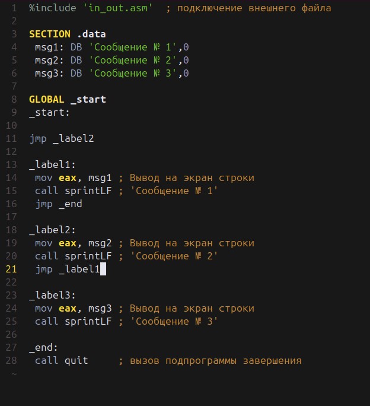

---
## Front matter
title: "Отчёт по лабораторной работе №7"
subtitle: "Дисциплина: Архитектура компьютера"
author: "Луангсуваннавонг Сайпхачан"

## Generic otions
lang: ru-RU
toc-title: "Содержание"

## Bibliography
bibliography: bib/cite.bib
csl: pandoc/csl/gost-r-7-0-5-2008-numeric.csl

## Pdf output format
toc: true # Table of contents
toc-depth: 2
lof: true # List of figures
lot: false # List of tables
fontsize: 12pt
linestretch: 1.5
papersize: a4
documentclass: scrreprt
## I18n polyglossia
polyglossia-lang:
  name: russian
  options:
	- spelling=modern
	- babelshorthands=true
polyglossia-otherlangs:
  name: english
## I18n babel
babel-lang: russian
babel-otherlangs: english
## Fonts
mainfont: IBM Plex Serif
romanfont: IBM Plex Serif
sansfont: IBM Plex Sans
monofont: IBM Plex Mono
mathfont: STIX Two Math
mainfontoptions: Ligatures=Common,Ligatures=TeX,Scale=0.94
romanfontoptions: Ligatures=Common,Ligatures=TeX,Scale=0.94
sansfontoptions: Ligatures=Common,Ligatures=TeX,Scale=MatchLowercase,Scale=0.94
monofontoptions: Scale=MatchLowercase,Scale=0.94,FakeStretch=0.9
mathfontoptions:
## Biblatex
biblatex: true
biblio-style: "gost-numeric"
biblatexoptions:
  - parentracker=true
  - backend=biber
  - hyperref=auto
  - language=auto
  - autolang=other*
  - citestyle=gost-numeric
## Pandoc-crossref LaTeX customization
figureTitle: "Рис."
tableTitle: "Таблица"
listingTitle: "Листинг"
lofTitle: "Список иллюстраций"
lotTitle: "Список таблиц"
lolTitle: "Листинги"
## Misc options
indent: true
header-includes:
  - \usepackage{indentfirst}
  - \usepackage{float} # keep figures where there are in the text
  - \floatplacement{figure}{H} # keep figures where there are in the text
---

# Цель работы

Целью данной лабораторной работы является изучение команд условного и безусловного переходов, приобретение навыков написания программ с использованием переходов, знакомство с назначением и структурой файла листинга.

# Задание
  1.  Реализация переходов в NASM
  2.	Изучение структуры файлы листинга
  3.  Выполнение заданий для самостоятельной работы
  
# Теоретическое введение

  Для реализации ветвлений в ассемблере используются команды перехода, которые можно разделить на два типа:

• Условный переход – выполнение или невыполнение перехода в определенную точку программы в зависимости от проверки условия. 

• Безусловный переход – выполнение перехода в заданную точку программы без каких-либо условий.

Безусловный переход выполняется инструкцией jmp (от англ. jump — прыжок), которая включает в себя адрес перехода, куда следует передать управление:
 ``jmp <адрес_перехода>``

Адрес перехода может быть меткой или адресом области памяти, в которую заранее помещен указатель перехода. 
Также в качестве операнда может использоваться имя регистра, в таком случае переход осуществляется по адресу, хранящемуся в этом регистре.

Команды условного перехода в ассемблере вычисляют условие перехода, анализируя флаги из регистра флагов.

  Флаг — это бит, принимающий значение 1 («флаг установлен»), если выполнено некоторое условие, и значение 0 («флаг сброшен») в противном случае.
  Флаги работают независимо друг от друга и помещены в единый регистр флагов, который отражает текущее состояние процессора.

Флаги состояния (биты 0, 2, 4, 6, 7 и 11) показывают результат выполнения арифметических инструкций, таких как ADD, SUB, MUL, DIV.

  Листинг (в рамках NASM) — это один из выходных файлов, создаваемых транслятором. 
  Он имеет текстовый вид и используется при отладке программы, так как, помимо строк программы, содержит дополнительную информацию.

Все ошибки и предупреждения, обнаруженные при ассемблировании, выводятся на экран, и файл листинга не создается

# Выполнение лабораторной работы

 **Примечание:**

  В этой лабораторной работе я буду использовать дистрибутив linux: **Ubuntu**, поскольку я хочу попробовать новый дистрибутив Linux,
   а также получить практические навыки работы с различными дистрибутивами, и я уже клонировал все предыдущие лабораторные работы в этот новый дистрибутив.

## Реализация переходов в NASM

Я создаю новую директорию, в которой буду создавать файлы с программами для лабораторной работы № 7, используя команду mkdir. 
Затем я перехожу в созданный каталог и создаю файл lab7-1.asm, используя команду touch.(Рис .4.1)


Я копирую файл in_out.asm из последней лабораторной работы, потому что он будет использоваться в других программах(Рис .4.2)


Я открываю созданный файл lab7-1.asm, затем вставляю программу, которая реализует безусловные переходы.(Рис .4.3)


Я создаю новый исполняемый файл и запускаю его, программа выводит текст " Сообщение № 2" и " Сообщение № 3"(Рис .4.4).
Используя инструкцию jmp _label1, которая изменяет порядок выполнения инструкций и позволяет нам выполнять инструкции, начиная с метки _label2, пропуская вывод первого сообщения.


Я снова захожу к файлу программы и меняю программу, добавляя инструкции `jmp _end` и `jmp _label1`(Рис .4.5)



Я создаю новый исполняемый файл и запускаю его.

На этот раз он выводит текст "Сообщение № 2" и "Сообщение № 1"(Рис .4.6). 
Поскольку инструкция `jmp _label2` позволяет нам выполнять инструкцию, начинающуюся с метки `_label2`, то в метке `_label2` есть инструкция `jmp _label1`, изменяющая порядок выполнения на метку `_label1.` 
После этого, используя команду `jump _end` в метке `_label1`, изменяет выполнение на метку `_end` (переход к инструкции call quit), которая завершает работу программы, пропуская вывод третьего сообщения.


Я создаю lab7-2.asm с помощью команды touch(Рис .4.7)


Я открываю созданный файл и вставляю программу, которая использовала условный переход, чтобы отобразить наибольшую из 3 целочисленных переменных: A, B и C(Рис .4.8)


Я создаю новый исполняемый файл и запускаю его, поскольку значения A и C заданы в программе, программа требует от пользователя только ввести значение B.(Рис .4.9)
Я ввожу значение B, которое равно 30, оно выдает наибольшее число 50. Поскольку в программе значение A равно 20, а значение C равно 50, следовательно, наибольшее число между A, B и C равно 50, что равно C
Я снова ввожу значение B, но на этот раз я ввожу 60, программа выдает, что наибольшее число равно 60. Что верно, поскольку B - это наибольшее число (B>C>A).


## Изучение структуры файлы листинга

Я создаю файл списка, используя ключ -l и указывая имя списка, я использую команду ls для проверки работы выполненной команды(Рис .4.10)


Затем, используя текстовый редактор helix, я открываю файл lab7-2.lst(Рис .4.11)


В файле lab7-2.lst одержит подробный вывод, показывающий исходный код ассемблера и соответствующий ему машинный код (или объектный код), который создаёт ассемблер.(Рис .4.12) 
	Я выбираю 3 строки из файла со списком и подробно объясняю это
  


**Пояснение:**

**Первая строка**

````26 00000116 890D[00000000] mov [max], ecx ; 'max = A'````

Эта инструкция перемещает значение из регистра `ecx` в память по адресу, который обозначен как `max`.

- `mov [max], ecx` означает, что значение из регистра `ecx` сохраняется по адресу `max`.

- Машинный код `890D[00000000]` представляет эту операцию, где `890D` — это код операции для mov с операндом в памяти, 
а` [00000000]` — это адрес `max`.

- Комментарий `('max = A')`: Это помогает пояснить, что если значение A хранится в регистре ecx, то оно записывается в переменную `max (max = A.)`.

**Вторая строка**

````28 0000011C 3B0D[39000000] cmp ecx,[C]   ; Сравниваем 'A' и 'С'````

Инструкция `cmp ecx, [C]` сравнивает значение в регистре ecx (которое хранит A) с значением по адресу C.

- Машинный код `3B0D[39000000]` соответствует инструкции cmp с операндом в памяти. Здесь `3B0D` — это код операции для cmp, а `[39000000]` — это адрес переменной C.

- Комментарий ('Сравниваем 'A' и 'С'): Комментарий точно описывает, что эта инструкция сравнивает значения A и C.

**Третья строка**

````30 00000124 8B0D[39000000] mov ecx,[C]   ; 'ecx = C'````

Инструкция `mov ecx, [C]` перемещает значение из памяти по адресу C в регистр `ecx`.

- Машинный код `8B0D[39000000]` соответствует этой операции. `8B0D` — это код операции для mov с операндом в памяти, а `[39000000]` — это адрес переменной C.

- Комментарий `('ecx = C')`: Это правильное уточнение. После этой инструкции регистр ecx будет содержать значение переменной C.

	После этого я снова открываю lab7-2.asm, затем удаляю один операнд в одной из инструкций с двумя операндами.
  
В этой инструкции cmp я удаляю `[C]` из инструкции. Это должно привести к ошибке, так как для работы этой инструкции требуется два операнда (Рис .4.13)


Затем я попытался создать объектный файл и файл списка, и это действительно выдало ошибку(Рис .4.14). 
В файле lab7-2.lst в строке инструкции код инструкции заменяется символом (***), который указывает на то, что в этой строке инструкции содержится ошибка.(Рис .4.15)


В этом случае файловый объектный файл lab7-2.o сгенерирован не будет, поскольку ассемблер не может обработать недопустимую инструкцию, а также в lab7-2.lst мы увидим символ (********) для недопустимой инструкции в файле листинга.

# Выполнение заданий для самостоятельной работы

Я создаю lab7-3.asm для выполнения файла задачи 1 с помощью команды touch(Рис .5.1)


Я открываю созданный файл для редактирования, и поскольку мой вариант из последней лабораторной работы (лабораторная работа № 6) равен 13,
 то мои значения для ввода задачи будут равны 84, 32, 77(Рис .5.2)


Я создаю и запускаю исполняемый файл, ввожу входные значения: 84, 32, 77 по порядку, и он выдает 32, что является правильным ответом, поскольку 32 - наименьшее число.
	Чтобы проверить корректность работы программы, я снова ввожу значения, я ввожу 5, 10 и 8, и она выдает 5.(Рис .5.3)
  
 Доказательство того, что программа работает правильно


Я создаю lab7-4.asm для выполнения файла задачи 2 с помощью команды touch(Рис .5.4)


Я вхожу в программу, которая требует от пользователя ввода значений 'x' и 'a', и вычисляю их в заданном выражении f(x). 
Поскольку мой вариант равен 13, мои значения (x,a) равны (3;9) и (6;4).(Рис .5.5)


Я создаю и запускаю исполняемый файл, я ввожу значение x, равное 3, и значение a, равное 9, оно выводит 2.(Рис .5.6)
Я ввожу значение снова, на этот раз значение x равно 6, а значение a равно 4, и оно выводит 24. Я проверяю работу программы, рассчитывая самостоятельно. Программа работает правильно.


 **Программа для выполнения задачи 1**

 ````
%include 'in_out.asm' ; подключение внешнего файла   

section .data
    msg1 db 'Введите a: ', 0h
    msg2 db 'Введите b: ', 0h
    msg3 db 'Введите c: ', 0h
    msg_result db 'Наименьшее число: ', 0h

section .bss
    a resb 10               
    b resb 10                
    c resb 10               
    min resb 10             

 ; Код программы
section .text
global _start  
_start:

; -- a
mov eax, msg1
call sprint

mov ecx, a
mov edx, 10
call sread

; -- b
mov eax, msg2
call sprint

mov ecx, b
mov edx, 10
call sread

; -- c
mov eax, msg3
call sprint

mov ecx, c
mov edx, 10
call sread

mov eax, a
call atoi
mov [a], eax

mov eax, b
call atoi
mov [b], eax

mov eax, c
call atoi
mov [c], eax

; --
mov eax, [a] ; eax = a
mov ebx, [b] ;ebx = b
cmp eax, ebx  
jl compare_bc ; если a < c
mov eax, ebx ; eax = ebx (b)

compare_bc:
mov ebx, [c]
cmp eax, ebx
jle fin ; если min(a,b) <= c
mov eax, ebx

fin:
mov [min], eax
mov eax, msg_result ; Вывод сообщения 'Наименьшее число: '
call sprint
mov eax, [min]
call iprintLF
call quit

````

 **Программа для выполнения задачи 2**

````
%include 'in_out.asm' ; подключение внешнего файла 
section .data
msg1 db 'Введите x: ',0h
msg2 db 'Введите a: ',0h
msg_result db 'Результат: ',0h

section .bss
result resb 10
x resb 10
a resb 10

; Код программы

section .text
global _start
_start:
; -- x
mov eax, msg1
call sprint
mov ecx, x
mov edx, 10
call sread
;--- a
mov eax, msg2
call sprint
mov ecx, a
mov edx, 10
call sread

;-------------
mov eax, x
call atoi
mov [x], eax

mov eax, a
call atoi
mov [a], eax

; --------------
mov eax, [a] ; eax = a
mov ebx, 7   ; ebx = 7
cmp eax, ebx 
jge cal_1 ; если a >= ebx (7)
mov ebx, [x] ; ebx = x
mul ebx ; eax = eax (a) * ebx(x)
jmp fin

cal_1:
mov ebx, 7 
sub eax, ebx ; eax = eax - ebx(7)


fin:
mov [result], eax
mov eax, msg_result
call sprint   ; Вывод сообщения 'Наименьшее число: '
mov eax, [result]
call iprintLF
call quit

````

# Выводы

При выполнении данной лабораторной работы, Я изучил команды условного и безусловного перехода, приобрел навыки написания программ с использованием переходов, 
ознакомился с назначением и структурой файла листинга.

# Ответы на вопросы для самопроверки

**1. Для чего нужен файл листинга NASM?В чём его отличие от текста программы?**

  Файл листинга NASM (.lst) нужен для того, чтобы показать, как программа на ассемблере была преобразована в машинный код. 
  Он отличается от обычного текста программы тем, что кроме исходного кода, в нём есть:

- Сгенерированный машинный код.

- Адреса, по которым будут загружены инструкции.

- Ошибки и предупреждения.

  Текст программы — это только исходный код без этих дополнительных данных.

 **2. Каков формат файла листинга NASM?Из каких частей он состоит?**

  Файл листинга обычно состоит из нескольких частей:

- Исходный код — сама программа на ассемблере.

- Машинный код — это бинарное представление команд.

- Адреса памяти — показывают, где будут находиться инструкции в памяти.

- Таблица символов — показывает, где находятся метки и переменные.

- Ошибки и предупреждения — если есть проблемы с кодом.

 **3. Как в программах на ассемблере можно выполнить ветвление?**

  Ветвление в ассемблере выполняется с помощью команд перехода:

  Безусловный переход `(jmp)` — всегда переходит по указанному адресу.
  Условные переходы — переходят только при выполнении определённого условия (например, если два значения равны). Условия определяются с помощью флагов, установленных командой cmp.

 **4. Какие существуют команды безусловного и условных переходов в языке ассемблера?**

  Безусловный переход:

*jmp* — всегда переходит на указанную метку или адрес.
Условные переходы:

*je (jump if equal)* — переход, если значения равны.

*jne (jump if not equal)* — переход, если значения не равны.

*jg (jump if greater)* — переход, если первое значение больше второго.

*jge (jump if greater or equal)* — переход, если первое значение больше или равно второму.

*jl (jump if less)* — переход, если первое значение меньше второго.

*jle (jump if less or equal)* — переход, если первое значение меньше или равно второму.

 **5. Опишите работу команды сравнения cmp.**

Команда cmp сравнивает два значения. Она не сохраняет результат, но обновляет флаги процессора (например, флаг равенства, переполнения). 
Эти флаги затем используются для условных переходов.

Пример:

````
cmp eax, ebx
````

Эта команда сравнивает значения в регистрах eax и ebx и обновляет флаги. Важно, что сама команда не сохраняет результат, а только изменяет флаги.

 **6. Каков синтаксис команд условного перехода?**

`[команда перехода] [метка]`

Пример:

*je label*   ; Переход на метку label, если значения равны

*jne label*  ; Переход на метку label, если значения не равны

Команды перехода зависят от флагов, установленных командой сравнения `(cmp)`.

 **7. Приведите пример использования команды сравнения и команд условного перехода.**

````
	cmp eax, ebx   ; Сравниваем eax с ebx
	je equal       ; Переходим на метку equal, если значения равны
	jne not_equal  ; Переходим на метку not_equal, если значения не равны
````

Если `eax` и ebx равны, программа перейдёт на метку `equal`.
Если значения не равны, переход будет на `not_equal`.

 **8. Какие флаги анализируют команды безусловного перехода**?

Команды безусловного перехода (jmp) не анализируют флаги процессора. Они всегда выполняют переход, независимо от состояния флагов.
      
# Список литературы
  [Архитектура ЭВМ](https://esystem.rudn.ru/pluginfile.php/2089087/mod_resource/content/0/Лабораторная%20работа%20№7.%20Команды%20безусловного%20и%20условного%20переходов%20в%20Nasm.%20Программирование%20ветвлений..pdf)
  
