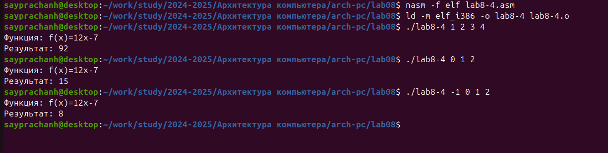

---
## Front matter
title: "Отчёт по лабораторной работе №8"
subtitle: "Дисциплина: Архитектура компьютера"
author: "Луангсуваннавонг Сайпхачан"

## Generic otions
lang: ru-RU
toc-title: "Содержание"

## Bibliography
bibliography: bib/cite.bib
csl: pandoc/csl/gost-r-7-0-5-2008-numeric.csl

## Pdf output format
toc: true # Table of contents
toc-depth: 2
lof: true # List of figures
lot: false # List of tables
fontsize: 12pt
linestretch: 1.5
papersize: a4
documentclass: scrreprt
## I18n polyglossia
polyglossia-lang:
  name: russian
  options:
	- spelling=modern
	- babelshorthands=true
polyglossia-otherlangs:
  name: english
## I18n babel
babel-lang: russian
babel-otherlangs: english
## Fonts
mainfont: IBM Plex Serif
romanfont: IBM Plex Serif
sansfont: IBM Plex Sans
monofont: IBM Plex Mono
mathfont: STIX Two Math
mainfontoptions: Ligatures=Common,Ligatures=TeX,Scale=0.94
romanfontoptions: Ligatures=Common,Ligatures=TeX,Scale=0.94
sansfontoptions: Ligatures=Common,Ligatures=TeX,Scale=MatchLowercase,Scale=0.94
monofontoptions: Scale=MatchLowercase,Scale=0.94,FakeStretch=0.9
mathfontoptions:
## Biblatex
biblatex: true
biblio-style: "gost-numeric"
biblatexoptions:
  - parentracker=true
  - backend=biber
  - hyperref=auto
  - language=auto
  - autolang=other*
  - citestyle=gost-numeric
## Pandoc-crossref LaTeX customization
figureTitle: "Рис."
tableTitle: "Таблица"
listingTitle: "Листинг"
lofTitle: "Список иллюстраций"
lotTitle: "Список таблиц"
lolTitle: "Листинги"
## Misc options
indent: true
header-includes:
  - \usepackage{indentfirst}
  - \usepackage{float} # keep figures where there are in the text
  - \floatplacement{figure}{H} # keep figures where there are in the text
---

# Цель работы

Целью данной лабораторной работы является приобретение навыков написания программ с использованием циклов и обработкой аргументов командной строки.

# Задание
  1.  Реализация циклов в NASM
  2.	Обработка аргументов командной строки
  3.  Выполнение заданий для самостоятельной работы
  
# Теоретическое введение

Стек — это структура данных, организованная по принципу LIFO **("Last In — First Out" или "последним пришёл — первым ушёл")**, то есть последний элемент, добавленный в стек, будет первым, который из него извлечётся.
Стек является важной частью архитектуры процессора и реализуется на аппаратном уровне. Для работы со стеком используются специальные регистры, такие как `ss, bp` и `sp`.

Основная функция стека — это хранение адресов возврата и передача аргументов при вызове функций. 
Также в стеке выделяется память для локальных переменных и могут храниться временные значения регистров. 
Стек имеет вершину, которая хранит адрес последнего добавленного элемента и находится в регистре `esp` (указатель стека). 
Противоположная вершине часть называется дном стека. При добавлении элемента в стек значение указателя `esp` уменьшается, а при извлечении — увеличивается.

Существует две основные операции с элементами стека:

`Push` — добавляет элемент в вершину стека. После этого регистр `esp` уменьшается на 4.

`Pop` — извлекает элемент из вершины стека. Регистр `esp` увеличивается на 4 после извлечения.

Команда `push` имеет один операнд — значение, которое нужно поместить в стек. Также есть дополнительные команды для добавления нескольких значений в стек:

`pusha` — помещает в стек содержимое всех регистров общего назначения в следующем порядке: `ax, cx, dx, bx, sp, bp, si, di.` Эта команда не требует операндов.

`pushf` — помещает в стек содержимое регистра флагов. Эта команда также не требует операндов.

Команда pop извлекает значение из вершины стека и сохраняет его в указанный операнд (регистр или память). Значение не стирается из памяти и остаётся как "мусор" до тех пор, пока не будет перезаписано новым значением.

Аналогично команде push существует команда popa, которая восстанавливает все регистры общего назначения из стека, а также команда popf, которая восстанавливает значение регистра флагов из стека.

Для организации циклов в ассемблере существуют специальные инструкции. Одной из самых простых является команда loop, которая позволяет создать безусловный цикл. 
Типичная структура цикла выглядит следующим образом:

````
mov ecx, 100   ; Устанавливаем количество итераций
NextStep:
...
... ; тело цикла
...
loop NextStep   ; Повторить цикл `ecx` раз, переходя к метке NextStep
````

Команда loop выполняется в два этапа: сначала из регистра `ecx` вычитается единица и его значение сравнивается с нулём. 
Если значение не равно нулю, то выполнение переходит к указанной метке. 
Если значение регистра равно нулю, переход не выполняется, и управление передается следующей инструкции, после команды loop.

# Выполнение лабораторной работы

## Реализация переходов в NASM

Я создаю новую директорию, в которой буду создавать файлы с программами для лабораторной работы № 8, используя команду mkdir. 
Затем я перехожу в созданный каталог и создаю файл lab8-1.asm, используя команду touch. (Рис.4.1)


Я копирую файл in_out.asm из последней лабораторной работы, потому что он будет использоваться в других программах (Рис.4.2)


Я открываю созданный файл lab8-1.asm, затем вставляю программу, которая реализует цикл (Рис.4.3)


Я создаю новый исполняемый файл и запускаю его (Рис.4.4). Я ввожу значение в программу, и программа выводит введенное мной число, 
а затем следующее число, которое со временем будет уменьшаться.


Я снова захожу к файлу программы и изменяю программу, добавляя инструкцию: `sub ecx, 1` (Рис.4.5)


Я создаю исполняемый файл и запускаю его. Затем я ввожу это значение в программу (Рис.4.6)


В результате программа выводит значение не в соответствии с тем, которое было введено, а выводит большое количество чисел, которые продолжают зацикливаться и вычитаться, это создает бесконечный цикл (Рис.4.7)

В программе, `ecx` принимает значение N, равное 3, и уменьшается на 2 (один раз с помощью `sub ecx, 1` и один раз с помощью цикла(loop)). В инструкции loop, если ecx равен нулю, цикл остановится, 
поскольку `ecx` уменьшается на 2, он проходит проверку нулевой точки, что означает, что цикл будет бесконечным


Но если я введу значение 2 (или любые четные числа) в программу, она выполнит цикл и выведет четные числа. поскольку `ecx` уменьшается на 2 при каждом цикле. (Рис.4.8)


Я снова захожу к файлу программы и изменяю программу.
На этот раз я добавляю инструкции `push ecx` и `pop ecx` (Рис.4.9)


Я создаю исполняемый файл и запускаю его. (Рис.4.10)
Затем я ввожу значение в программу, она выполняет цикл и выводит число в соответствии со значением, по которому я хочу выполнить цикл.


## Обработка аргументов командной строки

Я создаю новый файл lab8-2.asm с помощью touch (Рис.4.11)

 

Я открываю созданный файл lab8-2.asm и вставляю программу, которая отображает аргументы командной строки (Рис.4.12)


Я создаю исполняемый файл и запускаю его. (Рис.4.13)
В результате программа выводит 4 аргумента, так как в аргументе командной строки, строки 'аргумент' и '2' не связаны друг с другом (между ними есть пробел). 
Поэтому программа рассматривает это как два аргумента вместо одного и выводит "аргумент" и "2" отдельно.


Я создаю новый файл lab8-3.asm с помощью touch (Рис.4.14)


Я открываю созданный файл lab8-3.asm и вставляю программу (Рис.4.15)


Я создаю исполняемый файл и запускаю его (Рис.4.16), ввожу в программу аргументы в виде чисел, и в результате она выводит сумму чисел, которые были переданы в программу.


Я снова захожу к файлу программы и изменяю программу для вычисления произведения аргументов командной строки. (Рис.4.17)


Я создаю исполняемый файл и запускаю его. (Рис.4.18)
Я вставляю аргументы командной строки, и на этот раз программа выводит результат умножения аргументов.


**Код редактируемой программы**
````
 %include 'in_out.asm'

 SECTION .data
 msg db "Результат: ",0

 SECTION .text
 global _start
 _start:

 pop ecx  ; Извлекаем из стека в `ecx` количество
          ; аргументов (первое значение в стеке)
 pop edx  ; Извлекаем из стека в `edx` имя программы
          ; (второе значение в стеке)
 sub ecx,1 ; Уменьшаем `ecx` на 1 (количество
           ; аргументов без названия программы)
 mov esi, 1 ; Используем `esi` для хранения
            ; промежуточных сумм      
 
next:
 cmp ecx,0h ; проверяем, есть ли еще аргументы
 jz _end    ; если аргументов нет выходим из цикла
            ; (переход на метку `_end`)
 pop eax
 call atoi  ; иначе извлекаем следующий аргумент из стека
            ; преобразуем символ в число
 mul esi    ; умножение на esi           
 mov esi, eax ; след. аргумент `esi=eax`

 loop next  ; переход к обработке следующего аргумента
 
_end:
 mov eax, msg ; вывод сообщения "Результат: "
 call sprint
 mov eax, esi ; записываем сумму в регистр `eax`
 call iprintLF ; печать результата
 call quit  ; завершение программы
````

## Выполнение заданий для самостоятельной работы

Сначала я создаю новый файл lab8-4.asm, используя команду touch (Рис.4.19)


Я открываю созданный файл lab8-4.asm и начинаю вставлять программу (Рис.4.20). Поскольку мой вариант равен 13 (из лабораторной работы № 6), моя функция будет f(x) = 12x-7.


После этого я создаю исполняемый файл и запускаю его (Рис.4.21). Я ввожу аргументы командной строки в программу, и она выдает результат.
Чтобы проверить правильность работы программы, я вычисляю результат самостоятельно.
Программа работает правильно.



**Программа для выполнения задачи 1** 
````
%include 'in_out.asm'   ; подключение внешнего файла

section .data
msg1 db "Функция: f(x)=12x-7 ",0
result db "Результат: ",0

section .text
global _start
_start:
pop ecx
pop edx
sub ecx, 1
mov esi, 0 ; esi = 0

next:
cmp ecx, 0
jz _end

pop eax
call atoi
mov ebx, 12
mul ebx     ; eax = eax * ebx(12)

mov ebx, 7
sub eax, ebx ; eax = eax - ebx(7)

add esi, eax ; esi = esi + eax

loop next

_end:
mov eax, msg1
call sprintLF         ; Вывод сообщения 'Функция: f(x)=12x-7 '
mov eax, result
call sprint           ; Вывод сообщения 'Результат: '
mov eax, esi
call iprintLF         ; Результат 

call quit

````

# Выводы

При выполнении данной лабораторной работы, Я приобрел навыки написания программ с использованием циклов и обработки аргументов командной строки.

# Ответы на вопросы для самопроверки

**1. Опишите работу команды loop.**

Команда loop используется для создания цикла в ассемблере.

Команда loop уменьшает значение регистра ecx на 1 и проверяет, не равно ли оно нулю. 
Если ecx не ноль, происходит переход к метке (начало следующей итерации). Если ecx равен нулю, выполнение продолжается с инструкции после loop.

Пример:
````
mov ecx, 5
NextStep:
  ....
  ....   ; тело цикла
  ....
    loop NextStep
````

**2. Как организовать цикл с помощью команд условных переходов,не прибегая к специальным командам управления циклами?**

Цикл можно создать, используя dec ecx для уменьшения значения ecx и команду jnz для проверки, не равен ли ecx нулю. Пример:
````
mov ecx, 5
NextStep:
    ....
    ....  ; тело цикла
    ....
    dec ecx
    jnz NextStep
````

 **3. Дайте определение понятия «стек».**

Стек — это структура данных по принципу LIFO (последним пришёл — первым ушёл), где последний добавленный элемент извлекается первым. 
Он используется для хранения адресов возврата, аргументов и временных данных.

 **4. Как осуществляется порядок выборки содержащихся в стеке данных?**

Данные извлекаются по принципу LIFO: последний добавленный элемент извлекается первым. При выполнении pop значение извлекается, а указатель стека esp увеличивается на 4.
      
# Список литературы
  [Архитектура ЭВМ](https://esystem.rudn.ru/pluginfile.php/2089095/mod_resource/content/0/Лабораторная%20работа%20№8.%20Программирование%20цикла.%20Обработка%20аргументов%20командной%20строки..pdf)  
