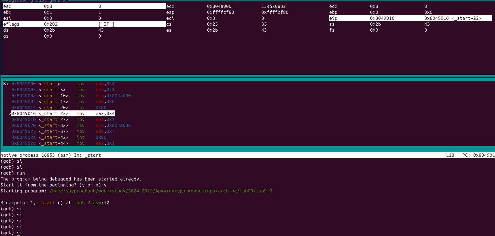

---
## Front matter
title: "Отчёт по лабораторной работе №9"
subtitle: "Дисциплина: Архитектура компьютера"
author: "Луангсуваннавонг Сайпхачан"

## Generic otions
lang: ru-RU
toc-title: "Содержание"

## Bibliography
bibliography: bib/cite.bib
csl: pandoc/csl/gost-r-7-0-5-2008-numeric.csl

## Pdf output format
toc: true # Table of contents
toc-depth: 2
lof: true # List of figures
lot: false # List of tables
fontsize: 12pt
linestretch: 1.5
papersize: a4
documentclass: scrreprt
## I18n polyglossia
polyglossia-lang:
  name: russian
  options:
	- spelling=modern
	- babelshorthands=true
polyglossia-otherlangs:
  name: english
## I18n babel
babel-lang: russian
babel-otherlangs: english
## Fonts
mainfont: IBM Plex Serif
romanfont: IBM Plex Serif
sansfont: IBM Plex Sans
monofont: IBM Plex Mono
mathfont: STIX Two Math
mainfontoptions: Ligatures=Common,Ligatures=TeX,Scale=0.94
romanfontoptions: Ligatures=Common,Ligatures=TeX,Scale=0.94
sansfontoptions: Ligatures=Common,Ligatures=TeX,Scale=MatchLowercase,Scale=0.94
monofontoptions: Scale=MatchLowercase,Scale=0.94,FakeStretch=0.9
mathfontoptions:
## Biblatex
biblatex: true
biblio-style: "gost-numeric"
biblatexoptions:
  - parentracker=true
  - backend=biber
  - hyperref=auto
  - language=auto
  - autolang=other*
  - citestyle=gost-numeric
## Pandoc-crossref LaTeX customization
figureTitle: "Рис."
tableTitle: "Таблица"
listingTitle: "Листинг"
lofTitle: "Список иллюстраций"
lotTitle: "Список таблиц"
lolTitle: "Листинги"
## Misc options
indent: true
header-includes:
  - \usepackage{indentfirst}
  - \usepackage{float} # keep figures where there are in the text
  - \floatplacement{figure}{H} # keep figures where there are in the text
---

# Цель работы

Целью данной лабораторной работы является приобретение навыков написания программ с использованием подпрограмм.
Знакомство с методами отладки при помощи GDB и его основными возможностями.

# Задание
  1.  Реализация подпрограмм в NASM
  2.	Отладка программам с помощью GDB
  3.  Выполнение заданий для самостоятельной работы
  
# Теоретическое введение

Отладка — это процесс поиска и исправления ошибок в программе. Общем случае его
  можно разделить на четыре этапа:
  
 • обнаружение ошибки;
 
 • поиск её местонахождения;
 
 • определение причины ошибки;
 
 • исправление ошибки.
	 
  Второй этап — Поиск местонахождения ошибки
  
Некоторые ошибки трудно обнаружить, но лучший способ найти их местоположение — это разделить программу на части и проверять их поочередно. 
Это позволяет сузить область поиска и быстрее обнаружить проблемный участок.

 Третий этап— Выяснение причины ошибки

После того как ошибка была локализована, обычно проще определить ее причину. Это может включать анализ данных, условий выполнения и логики программы.

 Последний этап — Исправление ошибки

После того как ошибка найдена и причины ее возникновения поняты, можно приступить к исправлению. 
После этого программа запускается снова, и, возможно, будет обнаружена другая ошибка, что заставит начать процесс отладки заново.

Отладчики — это инструменты, которые помогают контролировать выполнение программы, изменять данные и управлять процессом отладки. 
Они ускоряют поиск ошибок и их исправление. Наиболее распространенные методы работы с отладчиком включают использование точек останова и пошагового выполнения.
	
 Наиболее часто применяют следующие методы отладки:

 • создание точек контроля значений на входе и выходе участка программы (например, вывод промежуточных значений на экран—такназываемые диагностические сообще
ния);

 • использование специальных программ-отладчиков.

 Пошаговое выполнение — это выполнение программы с остановкой после каждой строчки,
 чтобы программист мог проверить значения переменных и выполнитьдругиедействия.
 Точки останова—это специально отмеченные места в программе,в которых программа
отладчик приостанавливает выполнение программы и ждёткоманд.Наиболее популярные
 видыточек останова:

 • Breakpoint — точка останова (остановка происходит, когда выполнение доходит до
 определённой строки,адреса или процедуры,отмеченной программистом);

 • Watchpoint — точка просмотра (выполнение программы приостанавливается, если
 программа обратиласьк определённой переменной:либо считала её значение,либо
 изменила его).

GDB (GNU Debugger — отладчик проекта GNU)— это отладчик для UNIX-подобных систем, который поддерживает отладку программ на многих языках программирования. 
GDB предоставляет обширные средства для контроля за выполнением программ и анализа их состояния. 
Он не имеет графического интерфейса, используя текстовый интерфейс командной строки, но существует ряд графических оболочек, использующих GDB в качестве основного инструмента для отладки.

С помощью GDB можно:

- Начать выполнение программы, настроив все параметры, влияющие на её поведение.
- Остановить выполнение программы при определенных условиях.
- Исследовать состояние программы, если она была остановлена.
- Изменить программу, чтобы протестировать изменения и устранить ошибки.

 Подпрограмма — это функционально завершенный участок кода, который можно многократно вызывать из разных частей программы. 
Это позволяет избежать повторений кода, упрощая его поддержку и сокращая размер программы.

 Если в программе встречается одинаковый участок кода, его можно оформить в виде
 подпрограммы,а во всех нужныхместахпоставитьеё вызов.При этом подпрограмма будет содержаться в коде в одном экземпляре, что позволит уменьшить размер кода всей
 программы.

 В отличие от простых переходов, подпрограммы содержат инструкцию возврата (return), которая позволяет вернуться в точку вызова. 
В языке ассемблера для вызова подпрограммы используется инструкция call, которая помещает адрес следующей инструкции в стек и передает управление подпрограмме. 
Когда подпрограмма завершает выполнение, она использует инструкцию ret, чтобы извлечь адрес из стека и вернуть управление в программу.

Подпрограммы могут быть как частью основной программы, так и находиться в отдельных внешних файлах.

# Выполнение лабораторной работы

## Реализация подпрограмм в NASM

Я создаю новую директорию, в которой буду создавать файлы с программами для лабораторной работы № 9, используя команду mkdir. 
Затем я перехожу в созданный каталог и создаю файл lab9-1.asm, используя команду touch. (Рис .4.1)
  


Я копирую файл in_out.asm из последней лабораторной работы, потому что он будет использоваться в других программах(Рис .4.2)


 
Я открываю созданный файл lab9-1.asm, затем вставляю программу, которая будет вычислять арифметическое выражение f(x) = 2x + 7 с помощью подпрограммы _calcul(Рис .4.3)


 
Я создаю исполняемый файл и запускаю его.  Я ввожу значение для расчета, после чего программа отображает результат.(Рис .4.4)


Я снова открываю файл lab9-1.asm для редактирования, чтобы вычислить выражение f(g(x)), (Рис .4.5)
я ввожу другую подпрограмму (_subcalcul) для вычисления выражения g(x) = 3x - 1, и я использую инструкцию 'call' в подпрограмме `_calcul` для того, чтобы пусть подпрограмма `_calcul`  использует подпрограмму `_subcalcul` для вычисления результата выражения f(g(x)).


Я создаю исполняемый файл и запускаю его, ввожу значение для расчета, и программа выдает результат(Рис .4.6). Я проверяю результат самостоятельно. Программа работает правильно.


**Программа для вычисления выражения f(g(x))**

````
%include 'in_out.asm'
 
SECTION .data
 msg:
 DB 'Введите x: ',0
 result: DB '2(3x-1)+7=',0
 
SECTION .bss
 x:   RESB 80
 res: RESB 80
 
SECTION .text 
GLOBAL _start
 _start:
;-----------------------------------------
; Основная программа 
;-----------------------------------------

mov eax, msg    ; вызов подпрограммы печати сообщения
call sprint     ; 'Введите x: '
 
mov ecx, x
mov edx, 80
call sread      ; вызов подпрограммы ввода сообщения
 
mov eax,x       ; вызов подпрограммы преобразования
call atoi       ; ASCII кода в число, `eax=x`
 
call _calcul    ; Вызов подпрограммы _calcul

mov eax,result
call sprint
mov eax,[res] 
call iprintLF
 
call quit
 
;-----------------------------------------
; Подпрограмма вычисления
; выражения "2x+7"
 
_calcul:
call _subcalcul
mov ebx,2
mul ebx
add eax,7
mov [res], eax

ret             ; выход из подпрограммы

; выражения "3x-1"

_subcalcul:
mov ebx, 3
mul ebx
sub eax, 1

ret
````

## Отладка программам с помощью GDB

Я создаю новый файл lab9-2.asm, используя команду touch(Рис .4.7)


Я открываю созданный файл lab9-2.asm и вставляю программу, которая будет выводить текст: "Hello, world!"(Рис .4.8)


Я создаю исполняемый файл, на этот раз я добавляю ключ отладочной информации "-g", чтобы работать с исполняемым файлом GDB.(Рис .4.9)


Я загружаю исполняемый файл lab9.2 в отладчике gdb(Рис .4.10)


Используя команду "run" в отладчике GDB, я проверяю работу программы(Рис .4.11). Программа работает нормально


Я устанавливаю точку останова с меткой _start, которая запускает выполнение программы сборки, чтобы получить более подробный анализ программы.(Рис .4.12)

Я запускаю программу снова, на этот раз она отображает точку останова, которую я создал.


Используя команду "disassemble _start", я просматриваю дизассемблированный программный код в метке _start.(Рис .4.13)


С помощью команды "set disassembly -flavor intel" я переключаюсь на отображение команд с синтаксисом Intel. 
Мы видим, что после выполнения команды "disassemble _start" она отображается с другим синтаксисом.(Рис .4.14)


Другой синтаксис - это синтаксис AT&T. Основное различие между синтаксисами AT&T и Intel в том, что в AT&T исходный операнд идет перед целевым, регистры имеют префикс "%", 
а немедленные значения — префикс "$", в то время как в Intel целевой операнд идет первым, регистры не имеют префикса, а немедленные значения не имеют префикса.(Рис .4.15)


Для более удобного анализа программы я включаю псевдографический режим, используя команды layout asm и layout regs.
В первом окне отображаются названия и текущие значения регистров, в середине отображается результат усвоения программы, а нижняя часть предназначена для ввода команд(Рис .4.16)


Чтобы проверить, что я уже установил точку останова на метке _start, я использую команду "info breakpoints" для просмотра информации обо всех точках останова(Рис .4.17)


Я определяю адрес предпоследней инструкции (mov ebx, 0x0) и устанавливаю другую точку останова , 
затем я использую команду "info breakpoints" или "i b" для просмотра информации обо всех точках останова.(Рис .4.18)


Используя команду stepi (si), я вручную просматриваю изменение значения регистров. Я выполнил команду 5 раз, 
в первом окне мы видим, что значение регистра eax изменено на 8, а регистр ebx изменен с 0 (по умолчанию) на 1.(Рис .4.19)



Я просматриваю содержимое регистров с помощью команды info registers или (i r)(Рис .4.20)


затем я отображаю содержимое переменной msg1 с помощью команды 'x/1sb &msg1'. 
Я задаю имя указанной переменной, которое я хочу использовать для просмотра содержимого, в данном случае это переменная msg1(Рис .4.21)


Затем я просматриваю содержимое msg2, но на этот раз я использую адрес переменной, который может быть определен с помощью разобранной инструкции, 
в этом случае адрес msg2 можно увидеть в mov ecx, 0x804a008, адрес которого равен 0x804a008(Рис .4.22)


Используя команду "set", я могу изменить значение регистра или памяти, указав имя регистра или адрес в качестве аргумента, а также указать тип данных в фигурных скобках. 
Я меняю первый и второй символы переменной msg1.(Рис .4.23)


Затем я также меняю первый и четвертый символы переменных msg2(Рис .4.24)


Используя команду print, я печатаю значение регистра edx в различных форматах, таких как /x для шестнадцатеричного, /t для двоичного и
/c для символьного. (Рис .4.25)
Некоторые значения можно просмотреть в окне, которое отображает название и текущее значение регистров.(Рис .4.26)


Мы можем видеть разницу вывода команд  `p/s $ebx`. Разница в том, что `set $ebx='2'` присваивает строку `'2'`, и команда `p/s $ebx` выводит её ASCII значение (50), а `set $ebx=2` присваивает число 2, и команда `p/s $ebx` выводит именно его.(Рис .4.27)


с помощью команды 'continue' (c) я завершаю работу программы и выхожу из GDB, используя команду quit (q).(Рис .4.28)


Я копирую файл lab 8-2.asm, созданный во время лабораторной работы № 8, и называю его lab9-3.asm(Рис .4.29)


Затем я создаю исполняемый файл
Используя key --args, я загружаю программу с аргументами в gdb.(Рис .4.30)


Я устанавливаю точку останова, используя команду break (b), и запускаю программу(Рис .4.31)


Введя команду x/x $esp, я могу увидеть количество аргументов, которые передаются программе(Рис .4.32). Поскольку адрес вершины стека хранится в регистре esp, и это число
равно количеству аргументов командной строки (включая название программы). 
В этом случае аргументами являются: ./lab9-3,аргумент1,аргумент,2 и 'аргумент 3'. Что равно 5 аргументам


Я просматриваю остальную часть стека.(Рис .4.33)
 
в [esp + 4] адрес в памяти, по которому находится название программы.

в [esp + 8], где хранится адрес первого аргумента, в [esp + 12] хранится адрес второго аргумента, в [esp + 16] - третьего и [esp + 20] четвертый.

в [esp + 24] ошибка появляется, когда GDB пытается получить доступ к NULL-указателю, что происходит, если передано меньше аргументов, чем ожидалось. 
В данном случае указывает на NULL, потому что аргументов меньше 6.


Адреса увеличиваются на 4 байта ([esp+4], [esp+8] и т.д.), потому что в архитектуре x86 аргументы функции записываются в стек как 4-байтовые указатели. 
Каждый указатель занимает 4 байта, поэтому указатель стека `(esp)` изменяется на 4 байта для каждого аргумента.

## Выполнение заданий для самостоятельной работы

Я копирую файл самостоятельного задания для последней лабораторной работы (лабораторная работа № 8) и меняю его название на lab9-4.asm(Рис .4.34)


Я открываю файл lab9-4.asm для редактирования. 
Я реализую подпрограмму, которая вычисляет значение функции f(x), (f(x) = 12x -7), 
а также добавляет инструкцию цикла для выполнения цикла программы, чтобы получить тот же результат.(Рис .4.35)


Я создаю исполняемый файл и запускаю его. 
Я ввожу аргументы для вычисления значения функции, и программа выдает результат, который является тем же результатом, что и в исходной программе, 
у которой нет подпрограммы.(Рис .4.36)


**Программа для выполнения задания 1**
````
%include 'in_out.asm'   ; подключение внешнего файла

section .data
msg1 db "Функция: f(x)=12x-7 ",0
result db "Результат: ",0

section .text
global _start
_start:
pop ecx
pop edx
sub ecx, 1
mov esi, 0 ; esi = 0

_process:
cmp ecx, 0
jz _end

pop eax
call atoi
call _subcalcul ; вызов подпрограммы _subcalcul
loop _process

_end:
mov eax, msg1
call sprintLF ;Вывод сообщения 'Функция: f(x)=12x-7 '
mov eax, result
call sprint   ;Вывод сообщения 'Результат: '
mov eax, esi
call iprintLF ;Результат 

call quit

; -- подпрограмма _subcalcul
_subcalcul:    
mov ebx, 12
mul ebx     ; eax = eax * ebx(12)

mov ebx, 7
sub eax, ebx ; eax = eax - ebx(7)

add esi, eax ; esi = esi + eax

ret
````

Используя команду "touch", я создаю новый файл lab9-5.asm(Рис .4.37)


Я открываю созданный файл lab9-5.asm, вставляю программу(Рис .4.38), которая выведет результат вычисления (3+2)*4+5


Я создаю исполняемый файл и запускаю его. Как мы видим, программа работает нормально, но выдает неверный результат.
Правильным результатом должно быть 25, но программа выдает 10, что неверно(Рис .4.39)


Я открываю отладчик (gdb)
Затем, используя команды layout regs и layout asm, я открываю окна, в одном из которых отображаются названия регистров и их текущие значения, а в другом - результат усвоения программы. 
Я добавляю точку останова в программу в _start, а затем запускаю программу, чтобы посмотреть, как работает эта программа.(Рис .4.40)


Используя инструкцию stepi (si), я вручную изменяю значения регистров, чтобы увидеть процесс работы программы.(Рис .4.41)
Затем я вижу, что в части инструкции `mul` регистр `ecx` (`ecx` равен 4) не умножается на значение регистра ebx, а вместо этого умножается на eax, который равен 2. 
Таким образом, в первом окне (в котором отображаются названия регистров и их текущие значения) мы видим, что значение регистра eax равно 8, поскольку eax (2) * ecx(4) = 8


Увидев неверную часть, я выхожу из отладчика и снова открываю lab9-5.asm, чтобы исправить программу.
Я изменил программу, так что теперь регистр eax будет содержать основное значение для расчета, а также для отображения результата.(Рис .4.42)

**Объяснение изменений:**

- Из `add ebx, eax` в `add eax, ebx`. Чтобы установить регистр eax в качестве основного значения.

- Из `add ebx, 5` в `add eax, 5`. чтобы добавить 5 в регистр eax

- Из `mov edi, ebx` в `mov edi, eax`.  чтобы перенести значение eax в регистр edi


Я создаю исполняемый файл и запускаю его. на этот раз программа выдает 25 в качестве результата, что является правильным результатом.(Рис .4.43) 
Это означает, что теперь программа работает правильно.


**Программа для выполнения задания 2**
````
%include 'in_out.asm'

 SECTION .data
 div: DB 'Результат: ',0

 SECTION .text
 GLOBAL _start
 _start:

 ;---- Вычисление выражения (3+2)*4+5
 mov ebx,3
 mov eax,2
 add eax,ebx ; от (add ebx, eax)
 mov ecx,4
 mul ecx
 add eax,5 ; от (add ebx, 5)
 mov edi,eax ; от (mov edi, ebx)

;---- Вывод результата на экран
 mov eax,div
 call sprint
 mov eax,edi
 call iprintLF

 call quit
````

# Выводы

При выполнении данной лабораторной работы, 
Я приобрел навыки написания программ с использованием подпрограмм, разобрался в методах отладки с использованием GDB и ее основных функциях.

# Ответы на вопросы для самопроверки

**1. Какие языковые средства используются в ассемблере для оформления и активизации
 подпрограмм?**

В ассемблере используются инструкции call для вызова подпрограммы и ret для возврата из подпрограммы.

**2. Объясните механизм вызова подпрограмм.**

При вызове подпрограммы инструкция call сохраняет адрес следующей инструкции в стек и передает управление подпрограмме. 
По завершении подпрограммы инструкция ret извлекает адрес из стека и передает управление обратно в вызывающую программу.

**3. Как используется стек для обеспечения взаимодействия между вызывающей и вызываемой процедурами?**

Стек сохраняет адрес возврата (инструкцию, следующую после call), параметры и локальные переменные. 
Это обеспечивает правильное возвращение в вызывающую программу и передачу данных между процедурами.

**4. Каково назначение операнда в команде ret?**
	
Операнд команды ret указывает, сколько данных следует удалить из стека перед возвратом. Обычно это количество параметров, переданных в подпрограмму.

**5. Для чего нужен отладчик?**

Отладчик позволяет анализировать выполнение программы, выявлять ошибки, контролировать данные, изменять состояние программы и пошагово её выполнять для проверки логики.

**6. Объясните назначение отладочной информации и как нужно компилировать программу, чтобы в ней присутствовала отладочная информация.**

Отладочная информация помогает отслеживать исходный код при отладке. 
Для её включения программу нужно компилировать с флагом, например, -g в GCC, чтобы включить символы отладки и маппинг исходного кода.

**7. Расшифруйте и объясните следующие термины: breakpoint, watchpoint, checkpoint, catchpoint и call stack.**

Breakpoint: Точка останова — место, где выполнение программы приостанавливается.

Watchpoint: Точка просмотра — программа приостанавливается, если изменяется или считывается указанная переменная.

Checkpoint: Место в программе, где состояние программы сохраняется для последующего восстановления.

Catchpoint: Точка, в которой отладчик перехватывает исключение или событие.

Call stack: Стек вызовов — структура данных, которая хранит последовательность вызовов функций.

**8. Назовите основные команды отладчика gdb и как они могут быть использованы для отладки программ.**

run: Запуск программы.

break <место>: Установка точки останова.

next: Пошаговое выполнение, переход к следующей строке.

step: Пошаговое выполнение, заход в подпрограмму.

continue: Продолжение выполнения после точки останова.

print <переменная>: Вывод значения переменной.

backtrace: Печать стека вызовов.

quit: Выход из отладчика.
      
# Список литературы
  [Архитектура ЭВМ](https://esystem.rudn.ru/pluginfile.php/2089096/mod_resource/content/0/Лабораторная%20работа%20№9.%20Понятие%20подпрограммы.%20Отладчик%20..pdf)  
