---
## Front matter
title: "Отчёт по лабораторной работе №10"
subtitle: "Дисциплина: Архитектура компьютера"
author: "Луангсуваннавонг Сайпхачан"

## Generic otions
lang: ru-RU
toc-title: "Содержание"

## Bibliography
bibliography: bib/cite.bib
csl: pandoc/csl/gost-r-7-0-5-2008-numeric.csl

## Pdf output format
toc: true # Table of contents
toc-depth: 2
lof: true # List of figures
lot: false # List of tables
fontsize: 12pt
linestretch: 1.5
papersize: a4
documentclass: scrreprt
## I18n polyglossia
polyglossia-lang:
  name: russian
  options:
	- spelling=modern
	- babelshorthands=true
polyglossia-otherlangs:
  name: english
## I18n babel
babel-lang: russian
babel-otherlangs: english
## Fonts
mainfont: IBM Plex Serif
romanfont: IBM Plex Serif
sansfont: IBM Plex Sans
monofont: IBM Plex Mono
mathfont: STIX Two Math
mainfontoptions: Ligatures=Common,Ligatures=TeX,Scale=0.94
romanfontoptions: Ligatures=Common,Ligatures=TeX,Scale=0.94
sansfontoptions: Ligatures=Common,Ligatures=TeX,Scale=MatchLowercase,Scale=0.94
monofontoptions: Scale=MatchLowercase,Scale=0.94,FakeStretch=0.9
mathfontoptions:
## Biblatex
biblatex: true
biblio-style: "gost-numeric"
biblatexoptions:
  - parentracker=true
  - backend=biber
  - hyperref=auto
  - language=auto
  - autolang=other*
  - citestyle=gost-numeric
## Pandoc-crossref LaTeX customization
figureTitle: "Рис."
tableTitle: "Таблица"
listingTitle: "Листинг"
lofTitle: "Список иллюстраций"
lotTitle: "Список таблиц"
lolTitle: "Листинги"
## Misc options
indent: true
header-includes:
  - \usepackage{indentfirst}
  - \usepackage{float} # keep figures where there are in the text
  - \floatplacement{figure}{H} # keep figures where there are in the text
---

# Цель работы

Целью данной лабораторной работы является приобретение навыков написания программ для работы с файлами.

# Задание
  1.	Выполнение лабораторной работы
  2.  Выполнение заданий для самостоятельной работы
  
# Теоретическое введение

   ОС GNU/Linux является многопользовательской операционной системой.Для обеспечения
ния защиты данных одного пользователя от действий других пользователей существуют
  специальные механизмы разграничения доступа к файлам.Кроме ограничения доступа,дан
ный механизм позволяет разрешить другим пользователям доступ данным для совместной
 работы.
   
   Права доступа определяют набор действий (чтение,запись,выполнение),разрешённых
 для выполнения пользователям системы над файлами.Для каждого файла пользователь
 может входить в одну из трех групп: владелец, член группы владельца, все остальные. Для
  каждой из этих групп может быть установлен свой набор прав доступа.Владельцем файла
 является его создатель.
   
   В операционной системе Linux существуют различные методы управления файлами,на
пример,такие как создание и открытие файла,только для чтения или для чтения и записи,
  добавления в существующий файл,закрытия и удаления файла,предоставление прав доступа

   Обработка файлов в операционной системе Linux осуществляется за счет использования
  определенных системных вызовов.Для корректной работы и доступа к файлу при его отсутствии
крытии или создании,файлу присваивается уникальный номер (16-битное целое число)
дескриптор файла.

# Выполнение лабораторной работы

Я создаю новый каталог, в котором я создам файлы с программами для лабораторной работы № 10, используя команду mkdir. 
Затем, используя команду touch, я создаю несколько файлов, таких как lab10-1.asm, readme-1.txt и readme-2.txt (Рис .4.1)

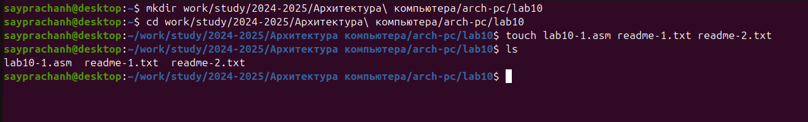

Я копирую файл in_out.asm из последней лабораторной работы, так как он будет использоваться с другой программой.(Рис .4.2)

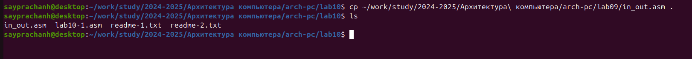

Я открываю созданный файл lab10-1.asm и вставляю программу, которая будет записывать данные в файл сообщения, которым в данном случае является файл .txt.(Рис .4.3)

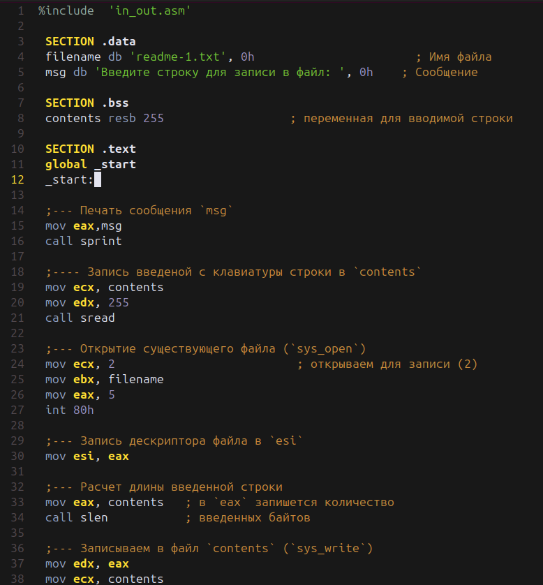

В исходном коде программы указано, что входные данные будут записываться в readme.txt.(Рис .4.4) 
Однако я не хочу создавать новый текстовый файл, я решил вместо этого заставить программу записывать входные данные в файл readme-1.txt.

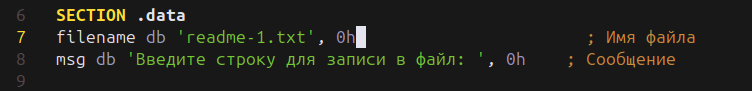

Я создаю исполняемый файл и запускаю его. 
Я ввожу в программу текстовую строку "Hello World!"(Рис .4.5)

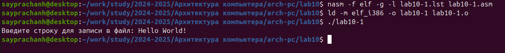

Используя команду cat, я отображаю содержимое текстового файла readme-1.txt.(Рис .4.6) 
Как мы видим, в нем отображаются данные, которые я ввел ранее. Это означает, что программа работает правильно.

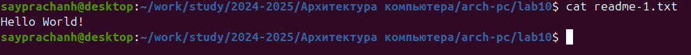

Используя утилиту ls и клавишу -l, я перечисляю информацию о файлах в каталоге "lab10". 
Эта информация включает имена файлов, время и дату их создания, а также права доступа к файлам, с которыми мы будем работать дальше.(Рис .4.7)

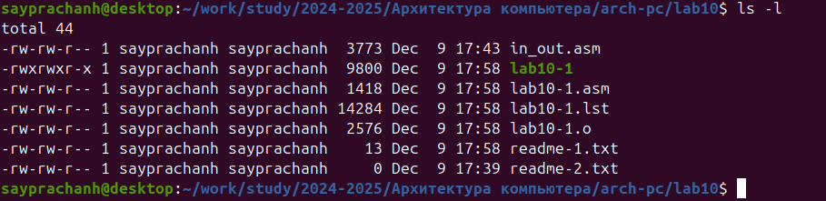

Используя команду chmod, я изменяю права доступа к файлу исполняемого файла lab10-1, добавляя -x к команде chmod, я удаляю разрешение на выполнение файла.
Используя команду ls -l, я проверяю работу команды. 
В результате в исполняемом файле lab10-1 в части прав доступа к файлу отсутствует символ "x", что означает, что программа не может быть запущена.(Рис .4.8)

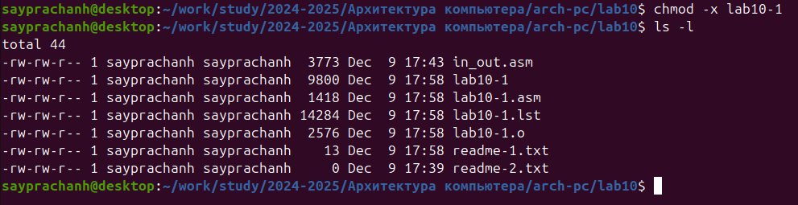

Когда я пытаюсь запустить файл, он выдает ошибку 'В разрешении отказано'.(Рис .4.9) 
Это означает, что его невозможно выполнить. Поскольку, когда я менял разрешение на доступ к файлу с помощью команды chmod, я не указывал, у кого я буду снимать разрешение. 
По умолчанию команда удалит разрешение на выполнение у всех, включая владельца, группу и других.

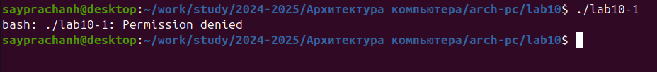

Используя команду chmod +x, я добавляю разрешение на выполнение в файл lab10-1.asm, затем проверяю работу команды, используя команду ls -l.(Рис .4.10)

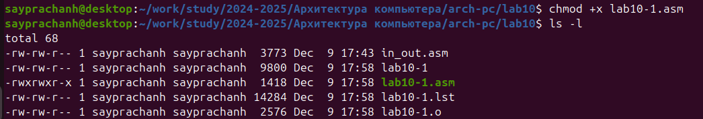

Я пытаюсь запустить файл lab10-1.asm, он выдает ошибку(Рис .4.11). Поскольку файл lab10-1.asm не является исполняемым файлом, это файл исходного кода (написанный на ассемблере). Следовательно, он не может быть выполнен напрямую, и когда вы попытаетесь его выполнить, он выдаст ошибку, и программа ничего не сделает.

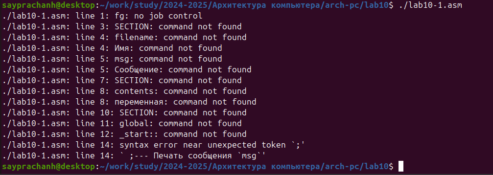

Используя команду chmod, я установил соответствующие права доступа к файлам readme-1.txt и readme-2.txt.(Рис .4.12) 
Согласно моему варианту (вариант 13), для файла readme-1.txt будет в символьном виде (-w- --x ---), а для файла readme-2.txt - в двоичной системе (110 011 001)
Для readme-2.txt Я преобразую двоичную систему счисления в восьмеричную, в этом случае соответствующие права доступа к файлам будут равны 631 или в буквенном (rw- -wx --x)

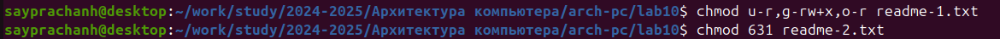

Затем, используя команду ls -l, я проверяю работу выполненной команды(Рис .4.13). Работа выполнена правильно. 

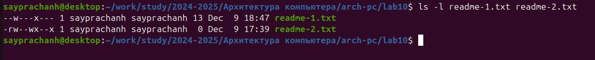

# Выполнение заданий для самостоятельной работы

Используя команду "touch", я создаю файлы name.asm(Рис .5.1)

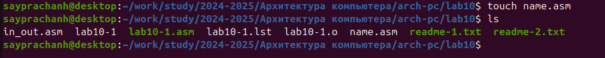

Я вхожу в программу, которая будет работать в соответствии с алгоритмом:
  выводит приглашение "Как вас зовут?", запрашивает ввод данных, создает name.txt файл, записывает сообщение "Меня зовут" в name.txt файл, 
  записывает вводимые данные в файл, затем закрывает файл.(Рис .5.2)

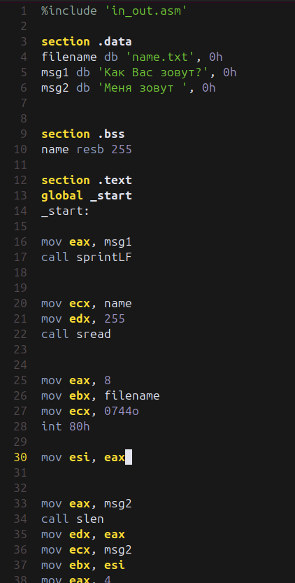

Я создаю исполняемый файл и запускаю его(Рис .5.3). Я ввожу свою фамилию и свое имя в программу.
Я проверяю работу программы, сначала используя команду ls, мы видим, что name.txt был создан в каталоге. 
Затем, используя команду cat, я отображаю содержимое файла name.txt, и действительно, в нем есть мое имя и текст сообщения.

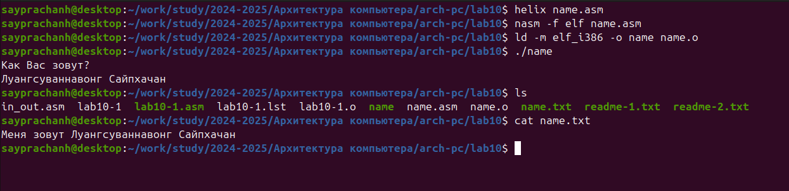

__Программа для выполнения задачи__
````
%include 'in_out.asm'

section .data
filename db 'name.txt', 0h
msg1 db 'Как Вас зовут?', 0h
msg2 db 'Меня зовут ', 0h


section .bss
name resb 255

section .text
global _start
_start:

mov eax, msg1
call sprintLF


mov ecx, name
mov edx, 255
call sread


mov eax, 8
mov ebx, filename
mov ecx, 0744o
int 80h

mov esi, eax


mov eax, msg2
call slen
mov edx, eax
mov ecx, msg2
mov ebx, esi
mov eax, 4
int 80h


mov eax, name
call slen
mov edx, eax
mov ecx, name
mov ebx, esi
mov eax, 4
int 80h

mov ebx, esi
mov eax,  6
int 80h

call quit 
````

# Выводы

При выполнении данной лабораторной работы, Я приобрел навыки написания написания программ для работы с файлами.

# Ответы на вопросы для самопроверки

**1. Каким образом в Unix-подобных ОС определяются права доступа к файлу?**

В Unix-подобных ОС права делятся на три категории: владельца, группы и остальных пользователей. 
Каждая категория может иметь права на чтение (r), запись (w) и выполнение (x). Эти права отображаются как строка, например, `rwxr-xr--.`

**2. Как ОС определяет,является ли файл исполняемым?Как регулировать права на чтение и запись?**

Файл исполним, если у пользователя есть право на выполнение (x). 
Чтобы изменить права на чтение или запись, используется команда chmod (например, `chmod +r` для чтения, `chmod +w` для записи).

**3. Как разграничить права доступа для различных категорий пользователей?**

Права доступа можно настроить с помощью команд:

chmod — для изменения прав на файл,

chown — для изменения владельца файла,

chgrp — для изменения группы файла.

**4. Какой номер имеют системные вызовы sys_read, sys_write, sys_open, sys_close,sys_creat.**

Номера системных вызовов:

sys_read: 0

sys_write: 1

sys_open: 2

sys_close: 3

sys_creat: 8 (обычно используется через sys_open с флагом O_CREAT).

**5. Какие регистры и как используют системные вызовы sys_read,sys_write,sys_open,sys_close,sys_creat.**

Для системных вызовов используются следующие регистры:

sys_read/sys_write: `EBX` (дескриптор файла), `ECX` (буфер), `EDX` (количество байт).

sys_open/sys_creat: `EBX` (имя файла), `ECX` (флаги), `EDX` (режим).

sys_close: `EBX` (дескриптор файла).

**6. Что такое дескриптор файла?**

Дескриптор файла — это число, которое процесс использует для работы с файлом. 
Он помогает операционной системе отслеживать открытые файлы и управлять операциями с ними, такими как чтение, запись и закрытие.      

# Список литературы
  [Архитектура ЭВМ](https://esystem.rudn.ru/pluginfile.php/2089097/mod_resource/content/0/Лабораторная%20работа%20№10.%20Работа%20с%20файлами%20средствами%20Nasm.pdf)  
